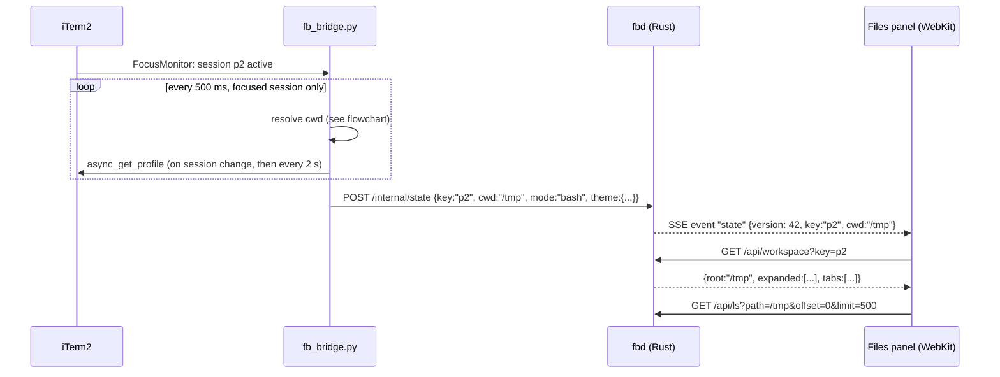
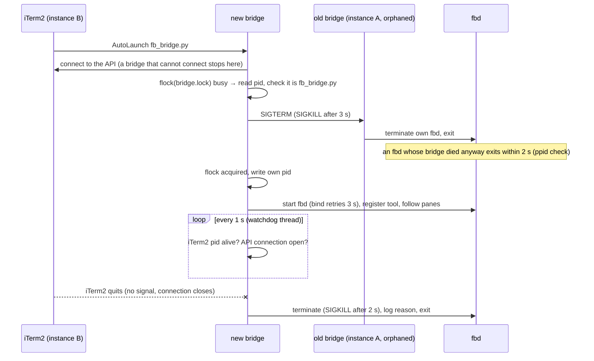
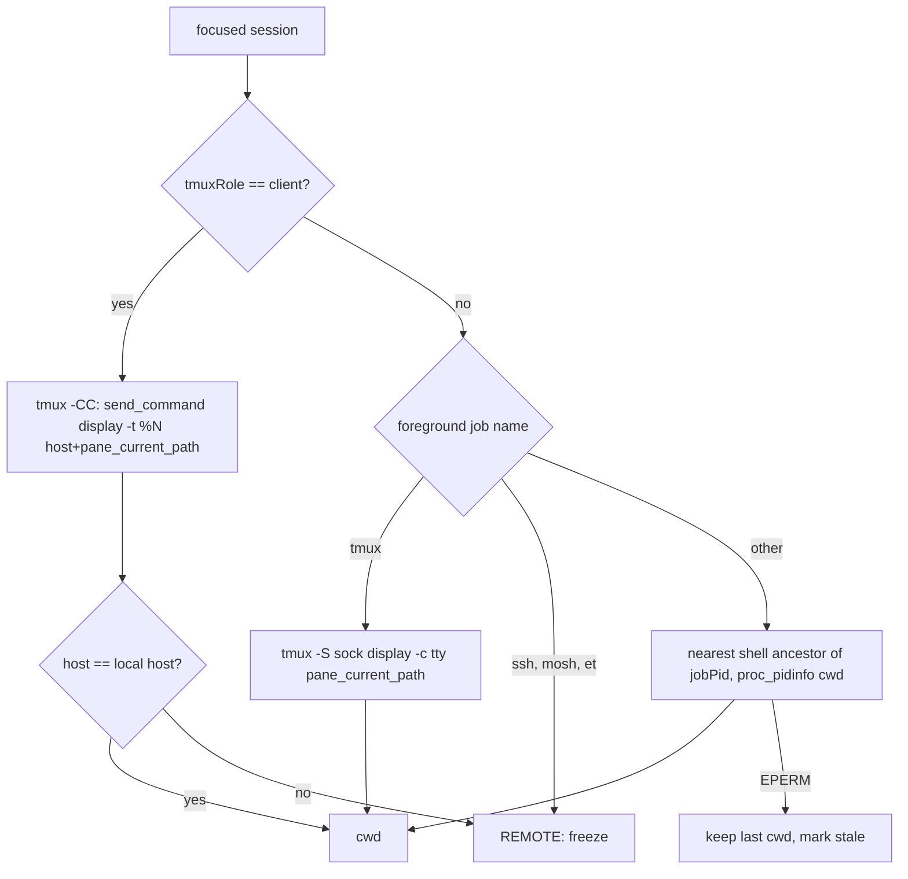
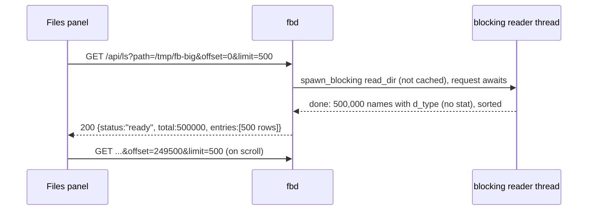
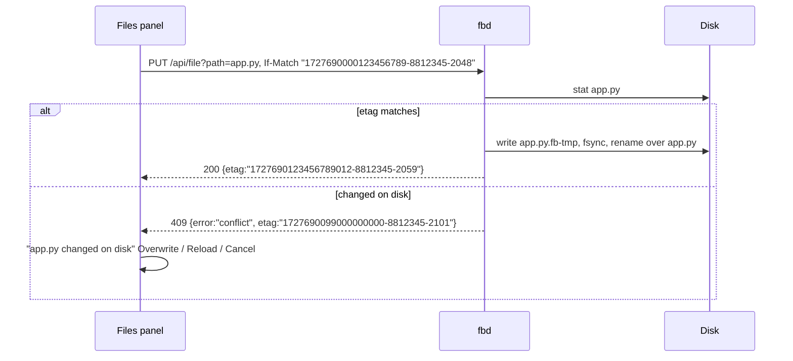

# iTerm2 File Browser — Specification

## 0. Metadata

| Field | Value |
|---|---|
| Version | 0.14.0 |
| Date | 2026-10-01 |
| Status | approved |
| Author | Project maintainers |

Change log:

| Version | Date | Change |
|---|---|---|
| 0.1.0 | 2026-09-30 | Initial draft, based on the working Python demo in `demo/` |
| 0.2.0 | 2026-09-30 | Pragmatic review + experiments: state keyed by session **and tmux pane**; AC-05 restart/scroll/GC split into AC-23 (P1); Markdown links split into AC-24 (P1); AC-02 progress row dropped (request waits); tab and pane caps removed; cache limit in MB; bridge secret for `/internal`; `Referrer-Policy`; etag = ns mtime + inode + size; SSE limit tested (14 streams OK); 500K read measured 0.8 s warm; OQ-07 (shortcuts) added |
| 0.3.0 | 2026-09-30 | Stage 1 + 2 + 3 implemented. Shortcuts that iTerm2 owns avoided (⌥N, ⌥⇧N, ⌥W instead of ⌘N, ⌘⇧N, ⌘W); rename is F2, Enter opens (AC-10, AC-15); filter applies inside shown folders (AC-16); `FB_APP_DIR` added for isolated tests; DoD updated with the actual test commands and results |
| 0.3.1 | 2026-09-30 | Prepared for open source: personal names, hosts and paths replaced by examples; the prototype in `demo/` removed (section 7 cites it as the starting point) |
| 0.4.0 | 2026-09-30 | Simplification pass: `fs-change` carries file etags and renames (`moved`); workspace events carry the writing panel (`X-FB-Client` → `by`); `/api/file` answers 304 to `If-None-Match`; listing pages carry `writable`, rows drop `m`; `insert` takes `paths` and fbd quotes them |
| 0.5.0 | 2026-10-01 | AC-25 (Toolbelt shown in new windows), AC-26 (⌘-click opens a viewer window; supersedes AC-20), AC-27 (layout defaults for new windows, own layout per open window), AC-28 (outdated panel link explained); Stage 4 |
| 0.6.0 | 2026-10-01 | AC-29: HTML documents render (sandboxed, no scripts) and links between Markdown and HTML documents open them, with `#anchor` |
| 0.7.0 | 2026-10-01 | AC-30 (P0): one bridge per iTerm2 — it exits with its iTerm2 or its API connection, a new bridge takes over from a leftover one (`bridge.lock`), a hung iTerm2 call cannot freeze the loop, and a panel nobody follows says so. Found when an iTerm2 restart left the old bridge and fbd running: the new bridge failed on the busy port, new windows got no Toolbelt and the panel showed an old directory as current. AS-08 added. Pragmatic review: lock taken only after the API connection is up, silence keyed on `bridge` (not `stale`), `make restart` exercises the takeover, Python unit tests join `make test`. Implementation review: a holder that exits during the takeover is not an error, a holder is judged again after 0.5 s, the silence event is sent under the state lock, a failing watchdog check is logged and the watch goes on; rejected: `make install` stopping a lockless bridge (no release has shipped one; the single local instance is stopped once by hand) |
| 0.8.0 | 2026-10-01 | AC-26: the viewer window opened as a terminal after an iTerm2 restart (iTerm2 3.7.3 loads dynamic profiles before its browser plugin, so "Files Viewer" was stored as a terminal profile); the bridge now checks and reloads the profile, closes a non-browser window, and every failed bridge command is shown in the panel that asked (`bridge-error`). The viewer window shows the file's full path with a copy button. AC-31 (expand and collapse all), AC-32 (file-type icons, Tabler Icons, MIT). Pragmatic review: failure message names no unverified cause, errors go only to the asking panel, expand all is cancelled by any re-root or collapse, icons vendored instead of an npm dependency; rejected: a profile "Title Components" change for the window title (iTerm2 browser windows compose their title themselves; not observable through the API). Implementation review: a window that fails its checks is never kept as the viewer; a folder dropped by a disk refresh no longer cancels expand all; expand all leaves folders the user had open; found and fixed: "Collapse all" left cached folders' children open (re-opening one showed them again) and a `/` root never restored its expanded folders |
| 0.9.0 | 2026-10-01 | Planned (Stage 7): AC-33 (one command installs or upgrades a versioned build and rolls back a build that does not come up), AC-34 (open panels and viewer windows move to the new build — at once when clean, after the save when dirty — with tree and tabs intact and no error flash for a short gap), AC-35 (rollback; older builds read newer state). Pragmatic review: cut the spare-port preflight (`fbd --version` instead), state format versioning (serde defaults suffice), tests inside install and a separate upgrade command; replaced stashing unsaved buffers in `sessionStorage` by reloading after the save; added migration from the unversioned layout, a build id covering the bridge, import-path pinning, prune only after health, no iTerm2 start, osascript permission errors, root refusal, an install lock and rollback without `previous`. Gaps found while reviewing the current upgrade: panels keep old code until reloaded, lazy chunks of an old panel may be gone, changes during the restart gap are missed, an old bridge may start a new fbd, no health check or rollback |
| 0.10.0 | 2026-10-01 | AC-36 (P0): a panel follows only the window it lives in. Found by the owner: switching to another window (with or without a Files panel) re-rooted the panel of the first window. Probes in iTerm2 3.7.3 (AS-09): a web view reports no window geometry (`screenX` 0, `outerWidth` 0), gets no focus/blur events, and neither browser sessions nor Toolbelt web views get `iterm2Invoke`; so the bridge marks the state of a window without a visible Toolbelt (`panel: false`) and panels ignore it; a panel claims the key window on load (dropped when two claims meet, as at launch) and binds for sure when the user acts in it (fbd asks the bridge for the key window after the request); the binding lives in `sessionStorage`; fbd keeps the last state per window. Pragmatic review: conflict rule instead of a 2 s load-burst rule, a pull through the bridge instead of waiting for the next push, the Toolbelt check on the bridge. Implementation review: a claim lives until the panel's last event stream closes (a late-closing old stream no longer drops it), a confirmed panel stops asking (clicks no longer delay terminal commands; `which-window` runs in its own bridge task), the per-window state cap drops the oldest window; live test: a load claim also asks the bridge (it used the last pushed state, which still named the previous window), the bridge answers from its cached Toolbelt state (re-reading the menu while a Toolbelt appears can say hidden), a claim needs an open event stream, and a window where load guesses collided stays contested until a user's action (a third guess no longer wins); accepted: a terminal command right after switching windows may be refused once (safe direction). Also observed: re-registering the tool reloads every open Files panel as new web views (input for AC-34: self-reload must use `location.reload()` to keep bindings) |
| 0.11.0 | 2026-10-01 | Stage 7 implemented (AC-33, AC-34, AC-35). The build id hashes the sources (bridge, fbd, UI sources and lockfiles), not `ui/dist`, because the UI bundle carries the id itself; the UI build writes it to `ui/.build-id` so the browser test runs its fbd as the same build; `FB_BUILD_ID` lets a test play another build. Panels reload in place with `location.reload()` (keeping token and window binding), once per build. AC-25: the menu is disabled while iTerm2 is not the active app (AS-10), so a new window stays pending and is retried while it is key, logged once; `e2e_windows.py` skips unless iTerm2 is in front. Step 0 (AS-10) was probed only as far as possible from inside a running iTerm2 session. Implementation review: the bridge says its build in its first post (a pane need not be focused), the wait is 30 s, `make` refuses root before building, the install lock lives outside what uninstall removes, the down-probe does not retry, a page still differing after its one reload says "Reload the panel to update". /simplify: one health check, one atomic link swap, one session-storage helper, the build id in one place (`build.rs` dropped: cargo tracks `option_env!`), the bridge's build sent once per fbd start; installer paths are read from the environment, not from `fbbridge.common` (an imported module kept the real paths under the test's temporary home, and a test run removed the live unversioned bridge copy, restored from the installed commit); the installer test now asserts every path it may delete is inside its temporary home |
| 0.12.0 | 2026-10-01 | Planned (Stage 8): AC-37 (browse the files of a remote host's tmux -CC pane through an fbd agent on that host, reached through ssh), AC-38 (one command makes a host ready: detects its platform, builds or takes the matching agent, installs it over ssh), AC-39 (one way to build the agent for macOS arm64/x86_64 and Linux x86_64/arm64, and a release built on the owner's own runner). The "remote file systems" non-goal is narrowed to hosts without an agent. Fable review (pragmatic agent): an explicit host on requests, workspaces and tabs instead of `//host` path prefixes (the prefix leaked into local file access: Rust collapses `//`), agents keyed by an agent id (fbd sources only), agent mode without desktop assumptions, host-name collisions refused, release hardened for a public repository, a trial tunnel at setup; kept against its advice: the release workflow and the macOS x86_64 build (owner's request). Implementation review (Fable): the agent takes no existing folder (removing it on exit could have wiped a home given by hand), a recorded host's pane always carries its host (a disconnected host must not read the same path on the Mac), a failed registration no longer leaves "connecting…" and a live ssh, hosts are registered again after fbd restarts, Trash on a macOS host uses the file manager (no Finder over ssh), an agent exits after 90 s without the Mac's event stream (sshd may not notice a dropped link), the runner keeps its toolchain and builds with 2 jobs, the relay buffer is capped, agent ids are checked before a remote shell sees them, banner lines are skipped, socket names are short; noticed, not fixed: the runner tarball is not checksum-verified, macOS hosts are not tested yet |
| 0.13.0 | 2026-10-01 | Planned (Stage 9), from the owner: a user who installs a package never runs `make` and should not need any step on the remote host. AC-38 becomes "enable a host from the panel": one click, once per host; the ssh destination comes from the command iTerm2's tmux gateway runs; the agent installs over that ssh into `~/.iterm-filebrowser/bin/` and logs into `~/.iterm-filebrowser/logs/` on the host (owner: easy to find). AC-40: a Mac package installed with one line, carrying fbd for both Mac architectures and the agents of all platforms, and a command `iterm-filebrowser` for upgrade, rollback, uninstall and hosts. No pairing: ssh is the authentication. Fable review: exact ssh arguments from the kernel (sysctl), `-o` options by allowlist; hosts keyed by their ssh destination (the name a host reports only labels it; cloud images share names); "Not now" lasts until the bridge restarts (a permanent refusal would contradict its label; the menu enables later); four thin binaries instead of a universal one (no lipo on a fresh Mac; the Mac's fbd is the macOS agent); the installer and the command use iTerm2's Python when the Command Line Tools are missing; install.sh downloads and checks in a temp folder with stable asset names; the Mac builds and uploads the package. Implementation review (Fable): Enable cleans up only Stage 8's `agent` folder (the whole `~/.local/lib/iterm-filebrowser` would have removed a Mac host's own install), the gateway cache checks the gateway session (iTerm2 reuses tmux connection ids), `host=` is percent-decoded and an unreadable host is refused (never local), Remove forgets at once and a connection finished meanwhile is dropped, one shape of `FB_RELEASE_URL`, Homebrew's python3 used when the Command Line Tools are missing, the Mac's architecture from `hw.optional.arm64` (Rosetta), `-o ""` and non-ASCII arguments handled |
| 0.14.0 | 2026-10-01 | From the owner: one root `~/.iterm-filebrowser/` everywhere, on the Mac and on hosts, for the command, builds, logs and state (was `~/.local/lib`, `~/.local/bin`, `~/Library/Application Support`, `~/Library/Logs`). The host helper becomes `bin/fbd-agent`, so a Mac host's own `bin/fbd` is untouched, and Remove deletes only the helper's files. The earlier layout is moved on upgrade (the token survives; old folders stay as links while a kept build uses them). Pragmatic review (approved with conditions): fixed a state folder created before the move (by the install lock or a new fbd) skipping the move for good and leaving the token behind — the lock moved to the root, an existing folder is merged and a clash refused; the move runs under the lock and after the package check, and for rollback and uninstall too; move errors are messages; a log recreated mid-move is merged; only our own `~/.local/bin/fbd` is removed; the PATH tip comes from the installer; the command stays the newest build's after a rollback; a marker file, not source text, says a build came from the old layout. |

## 1. Overview

**Problem.** In iTerm2, reading the current directory means `ls`, `cat`, `less` or another app; trees, Markdown and code are hard to scan; IDE trees do not follow the terminal's `cd`; huge folders freeze GUI browsers.

**Who it affects.** Developers on macOS who work in iTerm2 with plain bash, local tmux, and tmux -CC, often with several panes per window. **Expected outcome.** A "Files" panel lives inside every iTerm2 window (the Toolbelt, right side). It always shows the directory of the pane that has focus. It works like the file tree of an IDE: browse, open, read with syntax highlighting, render Markdown nicely, edit and save, create, rename and delete files and folders. It stays responsive in a directory with 500,000 entries. It remembers, per pane, which folders were open, what was selected and which files were open.

**Scenario, before and after.**
- Before: Alex runs `cd ~/work/api/docs`, types `ls`, then `less ci-design.md`, reads raw Markdown with `**` and `|---|` noise, quits, `cd ../src`, `ls`, opens `vim` to fix a typo, then forgets which files they looked at when they come back to this pane an hour later.
- After: Alex runs `cd ~/work/api/docs`. Within one second the Files panel shows `docs/`. Alex clicks `ci-design.md` and reads it rendered, with real tables and highlighted code blocks. Alex switches to the source view, fixes the typo, presses ⌘S. Alex switches to another pane: the panel shows that pane's directory with its own open folders. When Alex comes back, their folders, selection and open tabs are exactly where they left them.

## 2. Scope and non-goals

In scope:
- A Toolbelt web-view tool "Files", a Rust backend `fbd` on 127.0.0.1, and a Python bridge (iTerm2 AutoLaunch) that tracks the focused pane, its cwd (plain shell, local tmux, local tmux -CC) and theme.
- Reading (tree, 500K-entry folders, highlighted text, Markdown and HTML rendered, images), editing (save, create, rename, Trash, IDE context menu and keys), per-pane memory, theme and font from the profile, a separate viewer window.

Out of scope (explicit):
- Remote hosts without an agent, plain `ssh` panes (no tmux -CC), sshfs: the panel shows "remote" and freezes. Remote tmux -CC panes on a host with an agent are AC-37.
- A panel on the left side: the Toolbelt is right side only; a glued native window needs Accessibility permission and breaks in fullscreen (owner accepted, 2026-09-30).
- IDE features (LSP, project search), Windows/Linux (iTerm2 is macOS only), network access (loopback only).

## 3. Assumptions, dependencies, open questions

Assumptions:

| ID | Assumption | Owner | Status |
|---|---|---|---|
| AS-01 | iTerm2 3.6.x with "Enable Python API" turned on (verified: 3.6.11, `EnableAPIServer = 1`). | Owner | verified |
| AS-02 | Without shell integration, iTerm2 variable `path` updates ~0.5 s after `cd` in a plain shell (measured 2026-09-30). | Claude | verified |
| AS-03 | In plain tmux, `tmux display -c <tty> -p '#{pane_current_path}'` returns the focused tmux pane's cwd (measured with tmux 3.6a). | Claude | verified |
| AS-04 | In tmux -CC, `TmuxConnection.async_send_command("display -p -t %N ...")` returns `#{host}` and `#{pane_current_path}` for pane N. | Claude | verified in demo |
| AS-05 | The Toolbelt web view is WebKit (WKWebView) and supports ES2022, `color-mix()`, `local()` fonts, EventSource. | Claude | verified in demo |
| AS-06 | One user, one Mac, local SSD (APFS). Reading a 500K-entry directory takes about 1 s (measured 2026-09-30: `ls -f` on 500,000 files, 1.31 s first run, 0.81 s warm). | Claude | verified |
| AS-07 | Several Toolbelt web views (one per iTerm2 window) can each hold SSE streams without starving each other (measured: 2 views × 7 streams, a plain request still answers in 8–10 ms). | Claude | verified |
| AS-09 | An iTerm2 web view cannot learn which window it is in: `window.screenX/screenY` are 0 and `outerWidth/outerHeight` 0, no `focus`/`blur` fires on window switches, `document.hasFocus()` stays false, and `iterm2Invoke` exists in neither browser sessions nor Toolbelt web views (probed 2026-10-01, iTerm2 3.7.3). Registering the tool again with another URL reloads every open Toolbelt web view of it, as new web views: `sessionStorage` does not survive that (it does survive an in-page reload). A Toolbelt web view of a window that is not on screen (iTerm2 behind other apps) does not load until it is shown. | Claude | verified |
| AS-10 | `osascript -e 'tell application "iTerm2" to launch API script named "fb_bridge.py"'` relaunches the bridge from a terminal that macOS lets control iTerm2 (verified on the owner's Mac, every `make restart`); the "Show Toolbelt" menu reports enabled while iTerm2 is frontmost and was refused (`DISABLED`) while the owner worked in other apps. Not probed, to avoid quitting the iTerm2 session the work ran in: iTerm2 not running (the installer checks `pgrep -x iTerm2` and never calls osascript then), Automation denied (mapped from AppleEvent error -1743), Python API off (any other osascript failure, reported with its text). | Claude | partly verified |
| AS-08 | When iTerm2 quits it does not signal its AutoLaunch scripts; it only closes the API connection. `it2_api_wrapper.sh` runs Python as a child, so both outlive iTerm2 (observed 2026-10-01: after a restart the old wrapper, bridge and fbd ran on with ppid 1). Inside the `iterm2` module the reader task dies on the closed connection while pending calls wait forever. | Claude | verified |

Dependencies:

| ID | Dependency | Owner | Status |
|---|---|---|---|
| DEP-01 | Rust stable 1.98 (installed 2026-09-30 via `rustup default stable`), crates: axum 0.8, tokio 1, notify 8, rust-embed 8, trash 5, serde_json 1. | Claude | available |
| DEP-02 | Python `iterm2` module 2.14 inside iTerm2's own Python runtime (`~/Library/Application Support/iTerm2/iterm2env-*`). | Owner | available |
| DEP-03 | Node 26 + npm 11 at build time only: esbuild, CodeMirror 6 (`codemirror`, `@codemirror/language-data`), `markdown-it` 14. The bundle is embedded in `fbd`; no runtime network access. | Claude | available |
| DEP-04 | tmux ≥ 3.2 on PATH for tmux modes (verified 3.6a). | Owner | available |

Open questions:

| ID | Question | Owner | Status | Decision |
|---|---|---|---|---|
| OQ-01 | Where does a clicked file open: inside the panel, or in a wide iTerm2 pane? | Owner | resolved | Inside the panel: tree on top, viewer below, drag splitter, "maximize viewer" toggle. Wide iTerm2 browser pane is AC-20 (later). 2026-09-30 |
| OQ-02 | What happens to per-pane state on `cd`? | Owner | resolved | Tree state (expanded, selection, scroll) is cleared. Open file tabs stay, because they hold absolute paths and may have unsaved edits. 2026-09-30 |
| OQ-03 | What does "delete" do? | Owner | resolved | Move to macOS Trash (restorable in Finder). No permanent delete in the UI. 2026-09-30 |
| OQ-04 | Where may the panel write? | Owner | resolved | Only under `$HOME` and `/tmp` by default (`writable_roots`). Elsewhere is read-only. 2026-09-30 |
| OQ-05 | Does rendered Markdown execute raw HTML inside `.md` files? | Owner | resolved | No. Raw HTML is shown as text. A malicious README must not run script in the panel. 2026-09-30 |
| OQ-06 | Should state survive an iTerm2 restart, when session IDs may change? | Owner | open | Not tested yet (needs an iTerm2 restart). Not blocking: restart survival is AC-23 (P1). |
| OQ-07 | Which ⌘-shortcuts reach the panel and which are taken by iTerm2 menus (⌘S, ⌘W, ⌘N, ⌘F, ⌘⇧V)? ⌘W reaching iTerm2 would close the terminal session. | Owner | open | ⌘N/⌘W/⌘T are not used (⌥N, ⌥⇧N, ⌥W instead). ⌘S, ⌘⌫, ⌥⌘C are used and each also has a button or menu item; still to confirm by hand in the Toolbelt. |

## 4. Acceptance cases

| ID | Priority | Case |
|---|---|---|
| AC-01 | [MUST / P0] | The user can `cd` in the focused pane (bash, tmux, tmux -CC) and the tree re-roots at that directory within 1 s; a remote pane shows a frozen tree with a "remote" notice. |
| AC-02 | [MUST / P0] | The user can expand a folder with 500,000 entries and scroll it smoothly; first rows appear within 2.5 s and the panel never freezes. |
| AC-03 | [MUST / P0] | The user can click a text file and read it in a viewer tab with syntax highlighting chosen by file name. |
| AC-04 | [MUST / P0] | The user can open a Markdown file rendered with typography by default and switch to highlighted source with one click. |
| AC-05 | [MUST / P0] | The user gets back, per terminal pane (iTerm2 pane or tmux pane), the expanded folders, selection and open tabs after switching panes or reloading the panel; tree state clears on `cd`. |
| AC-06 | [MUST / P0] | The user can install with one command, and after an iTerm2 restart the Files tool is available with no manual steps. |
| AC-07 | [MUST / P0] | A web page or local process without the token cannot list, read or change files through the backend. |
| AC-08 | [SHOULD / P1] | The user can edit a text file and save it with ⌘S; unsaved tabs are marked, and a save over a file changed on disk is refused with a clear choice. |
| AC-09 | [SHOULD / P1] | The user can create an empty file or a folder in the selected folder through the context menu or a shortcut, with the name typed inline. |
| AC-10 | [SHOULD / P1] | The user can rename a file or folder inline (F2 or context menu); open tabs follow the new path. |
| AC-11 | [SHOULD / P1] | The user can move files and folders to the macOS Trash after one confirmation. |
| AC-12 | [SHOULD / P1] | The user can copy absolute or relative path, reveal in Finder, open with the default app, insert the path into the terminal, and `cd` the terminal to a folder. |
| AC-13 | [SHOULD / P1] | The user sees changes made by other programs (create, delete, rename, edit) in expanded folders and open tabs within 1 s. |
| AC-14 | [SHOULD / P1] | The user sees the panel in the colors and font of the focused pane's iTerm2 profile, including light/dark variants. |
| AC-15 | [SHOULD / P1] | The user can do every tree and tab action from the keyboard with IDE-standard shortcuts. |
| AC-16 | [SHOULD / P1] | The user can filter the tree by name, including inside a 500K-entry folder. |
| AC-17 | [SHOULD / P1] | The user can preview images (png, jpg, gif, webp, svg) in a viewer tab. |
| AC-18 | [SHOULD / P1] | The user can toggle hidden (dot) files on or off; the choice is remembered. |
| AC-19 | [SHOULD / P1] | The user can select several items (⌘-click, ⇧-click) and trash them or copy their paths in one action. |
| AC-20 | [NICE TO HAVE / later] | The user can open a file in a wide iTerm2 browser pane next to the terminal. [DROPPED — superseded by AC-26 (a separate viewer window), 2026-10-01] |
| AC-21 | [NICE TO HAVE / later] | The user sees git status colors (modified, added, ignored) in the tree. |
| AC-22 | [NICE TO HAVE / later] | The user can move files between folders by drag and drop. |
| AC-23 | [SHOULD / P1] | The user gets the per-pane state back after the backend restarts, with the scroll position; idle state is cleaned up after 14 days. |
| AC-24 | [SHOULD / P1] | The user can follow links in rendered Markdown: local `.md` links open in a new tab, web links open in the default browser, the panel never navigates away. |
| AC-25 | [SHOULD / P1] | The user sees the Files panel in every new iTerm2 window without pressing ⇧⌘B; windows where the user hid it stay hidden. |
| AC-26 | [SHOULD / P1] | The user can ⌘-click a file (or ⌘↩, or "Open in Window") to read and edit it in a large separate viewer window; further files open as tabs there. |
| AC-27 | [SHOULD / P1] | The user's latest Toolbelt width and tree/viewer split become the default for new windows, while every open window keeps its own until it is closed. |
| AC-28 | [SHOULD / P1] | The user whose panel holds an outdated link sees what is wrong and how to fix it instead of an endless "connecting…". |
| AC-29 | [SHOULD / P1] | The user reads HTML files rendered (scripts never run) and follows links inside Markdown and HTML documents to other documents, including `#anchors`. |
| AC-30 | [MUST / P0] | The user finds the panel following the terminal again after iTerm2 quits, restarts or the bridge is relaunched, with no manual cleanup; a panel that nothing follows says so instead of showing an old directory as current. |
| AC-31 | [SHOULD / P1] | The user can expand every folder below the root or a chosen folder in one action, bounded so large trees stay responsive, and collapse them all again. |
| AC-32 | [SHOULD / P1] | The user recognizes a file's type by its icon in the tree and the tabs. |
| AC-33 | [SHOULD / P1] | The user installs or upgrades with one command; the new build is checked before it goes live, takes over the running one within seconds, and a failing build leaves the old one running. |
| AC-34 | [SHOULD / P1] | The user keeps working through an upgrade: open panels and viewer windows switch to the new build by themselves, keeping unsaved edits, tree and tabs, and a short restart gap shows no error. |
| AC-35 | [SHOULD / P1] | The user can go back to the previous build with one command, and state files written by either build stay readable by both. |
| AC-36 | [MUST / P0] | The user sees in each window's Files panel only that window's panes: focusing another window, with or without a Files panel, never changes it. |
| AC-37 | [SHOULD / P1] | The user browses, reads, edits, creates, renames and trashes the files of a remote tmux -CC pane (a host reached with ssh) as if they were local, with live refresh, once that host has an agent. |
| AC-38 | [SHOULD / P1] | The user enables a remote host's files with one click in the panel the first time a tmux -CC pane of that host is focused; nothing is installed on a host without that click, and nothing has to be done on the host itself. |
| AC-40 | [SHOULD / P1] | The user installs, upgrades, rolls back and uninstalls the File Browser with one line or one command each, from a package that needs no build tools, and manages enabled hosts with the same command. |
| AC-39 | [SHOULD / P1] | The maintainer builds the agent for macOS arm64 and x86_64 and Linux x86_64 and arm64 (Ubuntu, Debian) the same way on the Mac and on the owner's runner, and publishes them as a release built on that runner. |

## 5. BDD scenarios

### AC-01 — Tree follows the focused pane's directory [MUST / P0]

```gherkin
Scenario Outline: AC-01 happy path — cd re-roots the tree
  Given the Files panel is visible in window "w1"
  And pane "p1" runs "<mode>" and has focus
  When the user runs "cd /Users/alex/work/api" in "p1"
  Then within 1 s the panel header shows mode badge "<badge>" and path "~/work/api"
  And the tree root lists the entries of "/Users/alex/work/api"

  Examples:
    | mode          | badge    |
    | bash          | BASH     |
    | tmux (plain)  | TMUX     |
    | tmux -CC      | TMUX -CC |

Scenario: AC-01 happy path — focus moves between split panes
  Given pane "p1" is in "/Users/alex/work/api" and pane "p2" is in "/tmp"
  When the user clicks into "p2"
  Then within 1 s the tree root is "/tmp"

Scenario: AC-01 edge — foreground program in a subdirectory
  Given pane "p1" shell cwd is "/Users/alex/work/api" and "vim" runs there after ":cd src"
  Then the tree root stays "/Users/alex/work/api" (the shell's cwd, not the job's)

Scenario: AC-01 failure — remote session
  Given the focused pane runs "ssh devbox" or a tmux -CC session whose host is "devbox.example"
  Then the badge shows "REMOTE", the note shows "remote host devbox.example"
  And the tree keeps the last local root, marked "cwd unavailable — showing last known"
```

### AC-02 — Very large folders stay responsive [MUST / P0]

```gherkin
Scenario: AC-02 happy path — 500K folder
  Given "/tmp/fb-big" holds 500,000 files named "f000000.txt".."f499999.txt"
  When the user expands "fb-big"
  Then the folder shows a spinner row while the backend reads, and other folders stay usable
  And within 2.5 s (warm disk cache) the first rows "f000000.txt".. are visible, sorted naturally
  And the scrollbar reflects 500,000 rows
  And the tree never renders more than 300 DOM rows at once

Scenario: AC-02 edge — scrolling to the end
  Given "fb-big" is expanded and loaded
  When the user drags the scrollbar to the bottom
  Then within 300 ms rows "f499700.txt".."f499999.txt" are visible
  And typing "j"/"k" still moves the selection without delay

Scenario: AC-02 failure — permission denied
  Given "/private/var/root" is not readable by the user
  When the user expands it
  Then the folder shows one row "⚠ Permission denied (os error 13)"
  And the rest of the tree remains usable
```

### AC-03 — Read a file with syntax highlighting [MUST / P0]

```gherkin
Scenario Outline: AC-03 happy path — highlighting by name
  When the user clicks "<file>"
  Then a viewer tab "<file>" opens read-only with "<language>" highlighting and line numbers

  Examples:
    | file          | language   |
    | server.rs     | Rust       |
    | app.py        | Python     |
    | Dockerfile    | Dockerfile |
    | config.yaml   | YAML       |
    | notes.txt     | Plain text |

Scenario: AC-03 edge — binary file
  When the user clicks "logo.ico"
  Then the tab shows "Binary file (image/vnd.microsoft.icon), 15 K" and a button "Open with default app"

Scenario: AC-03 edge — huge file
  Given "access.log" is 48.2 MB
  When the user clicks it
  Then the tab shows the first 1 MB as plain text with the banner "48.2 MB — showing first 1 MB, editing disabled"

Scenario: AC-03 error — file deleted before open
  Given "old.txt" was deleted by another program
  When the user clicks it
  Then the tab shows "⚠ No such file or directory (os error 2)" and no other tab changes
```

### AC-04 — Markdown rendered and source views [MUST / P0]

```gherkin
Scenario: AC-04 happy path — rendered by default
  When the user clicks "README.md"
  Then the tab opens in "Rendered" mode with proportional body text, headings, tables, task lists
  And fenced ```rust blocks are syntax highlighted
  And relative images like "" are displayed

Scenario: AC-04 happy path — toggle to source
  Given "README.md" is open rendered
  When the user clicks "Source"
  Then the tab shows the Markdown source with Markdown highlighting
  And the choice is remembered for this tab

Scenario: AC-04 edge — raw HTML is inert
  Given "evil.md" contains ""
  When the user opens it rendered
  Then the HTML appears as literal text and no script runs (OQ-05)
```

### AC-05 — Per-pane memory [MUST / P0]

```gherkin
Scenario: AC-05 happy path — switching panes restores state
  Given in pane "p1" (root "~/work/api") folders "src" and "src/db" are expanded, "src/db/pool.rs" is selected
  And tabs "README.md" and "pool.rs" are open, "pool.rs" active
  When focus moves to pane "p2" and back to "p1"
  Then "src" and "src/db" are expanded, "pool.rs" is selected and scrolled into view
  And tabs "README.md" and "pool.rs" are open with "pool.rs" active

Scenario: AC-05 happy path — survives a panel reload
  Given the state above
  When the user closes and reopens the Files tool (View → Toolbelt → Files)
  Then the same state is shown for "p1"

Scenario: AC-05 edge — tmux panes inside one iTerm2 pane
  Given pane "p1" runs plain tmux with tmux panes "%3" in "~/work/api" and "%4" in "/tmp"
  And in "%3" folder "src" is expanded
  When the user switches tmux panes "%3" → "%4" → "%3"
  Then "src" is expanded again (state is keyed by "tmux:default:%3", not by "p1")

Scenario: AC-05 edge — cd clears tree state, keeps tabs
  Given the state above
  When the user runs "cd ~/work/web" in "p1"
  Then the tree shows "~/work/web" with no folder expanded and nothing selected
  And tabs "README.md" and "pool.rs" are still open (OQ-02)

Scenario: AC-05 edge — expanded folder was deleted
  Given "src/db" is remembered as expanded but was deleted
  When the state is restored
  Then "src/db" is silently dropped from the expanded set
```

### AC-06 — One-command install and autostart [MUST / P0]

```gherkin
Scenario: AC-06 happy path — install
  Given the repo is at "~/src/iterm-filebrowser"
  When the user runs "make install"
  Then "fbd" is copied to "~/.iterm-filebrowser/bin/fbd"
  And "fb_bridge.py" is copied to "~/Library/Application Support/iTerm2/Scripts/AutoLaunch/"
  And the command prints "Installed. Restart iTerm2 or run Scripts → AutoLaunch → fb_bridge.py"

Scenario: AC-06 happy path — autostart
  Given the install above
  When iTerm2 starts
  Then within 5 s "View → Toolbelt → Files" exists and the panel shows the focused pane's directory

Scenario: AC-06 failure — port busy
  Given another program listens on 127.0.0.1:47821
  When the bridge starts "fbd"
  Then "fbd" exits with "error: port 47821 in use (set FB_PORT)" in "~/.iterm-filebrowser/logs/fbd.log"
```

### AC-07 — Only the panel can use the backend [MUST / P0]

```gherkin
Scenario Outline: AC-07 error — requests without a valid token or host are refused
  When a client sends "<request>"
  Then the response is "<status>" with body {"error": "<code>"}
  And no file is read or changed

  Examples:
    | request                                                           | status | code          |
    | GET /api/ls?path=/Users/alex (no token)                           | 401    | bad_token     |
    | GET /api/ls?path=/Users/alex, Host: evil.example:47821            | 403    | bad_host      |
    | POST /api/fs/mkdir with token, Origin: http://evil.example        | 403    | bad_origin    |
    | POST /api/fs/mkdir with token, Content-Type: text/plain           | 415    | bad_content_type |

Scenario: AC-07 happy path — the Files tool works
  Given the tool URL "http://127.0.0.1:47821/?t=<token>"
  When the panel loads
  Then GET /api/state returns 200
```

### AC-08 — Edit and save [SHOULD / P1]

```gherkin
Scenario: AC-08 happy path — save
  Given "app.py" is open in a tab
  When the user types "import os" at line 1 and presses ⌘S
  Then the tab title loses its "●" dirty marker
  And "app.py" on disk contains "import os" at line 1 and keeps its permissions

Scenario: AC-08 error — changed on disk since opened
  Given "app.py" was opened with etag "1727690000123456789-8812345-2048" and then changed by vim
  When the user presses ⌘S
  Then the save is refused with "app.py changed on disk" and buttons "Overwrite", "Reload (discard mine)", "Cancel"
  And the file on disk is unchanged until the user picks "Overwrite"

Scenario: AC-08 error — outside writable roots
  Given "/etc/hosts" is open
  Then the tab is read-only with banner "Read-only: outside writable folders"

Scenario: AC-08 edge — close a dirty tab
  Given "app.py" has unsaved changes
  When the user closes the tab (⌘W)
  Then a prompt asks "Save changes to app.py?" with "Save", "Don't save", "Cancel"
```

### AC-09 — Create file or folder [SHOULD / P1]

```gherkin
Scenario: AC-09 happy path — new file
  Given folder "src" is selected
  When the user presses ⌥N (or the header button, or context menu "New File…") and types "util.rs" then Enter
  Then "src/util.rs" exists with size 0, is selected, and opens in a tab

Scenario: AC-09 happy path — new folder
  When the user presses ⌥⇧N in "src" and types "db/migrations" then Enter
  Then "src/db/migrations" exists (intermediate folders created) and is expanded

Scenario Outline: AC-09 error — invalid name
  When the user types "<name>" for a new file in "src"
  Then the inline field shows "<message>" in red and nothing is created

  Examples:
    | name      | message                                   |
    | util.rs   | "util.rs" already exists in src            |
    | (empty)   | A name is required                         |
    | ..        | ".." is not a valid name                   |

Scenario: AC-09 error — no permission
  Given "/usr/local" is outside writable roots
  Then "New File…" and "New Folder…" are disabled in its context menu
```

### AC-10 — Rename [SHOULD / P1]

```gherkin
Scenario: AC-10 happy path — rename a file with an open tab
  Given "notes.md" is selected and open in a tab
  When the user presses F2 (or context menu "Rename…"), types "ideas", presses Enter (the extension stays preselected-out)
  Then "ideas.md" exists, "notes.md" does not, and the tab is titled "ideas.md"

Scenario: AC-10 edge — Esc cancels
  When the user presses F2, types "x", presses Esc
  Then nothing is renamed

Scenario: AC-10 error — target exists
  Given "ideas.md" already exists
  When the user renames "notes.md" to "ideas.md"
  Then the field shows ""ideas.md" already exists" and both files are unchanged
```

### AC-11 — Move to Trash [SHOULD / P1]

```gherkin
Scenario: AC-11 happy path — trash a folder
  When the user selects "build" and presses ⌘⌫
  Then a dialog asks "Move "build" to Trash?" with "Move to Trash" and "Cancel"
  When the user confirms
  Then "build" is in "~/.Trash" and gone from the tree; open tabs under it close

Scenario: AC-11 error — file is gone already
  Given "build" was deleted by another program
  When the user confirms trashing it
  Then a toast shows "build: No such file or directory" and the tree refreshes

Scenario: AC-11 edge — dirty tab inside
  Given "build/out.txt" has unsaved edits in a tab
  Then the dialog adds "1 unsaved file will be lost" before confirming
```

### AC-12 — Standard utility actions [SHOULD / P1]

```gherkin
Scenario Outline: AC-12 happy path — context menu actions
  Given the tree root is "/Users/alex/work/api" and "src/db/pool.rs" is selected
  When the user picks "<action>"
  Then "<result>"

  Examples:
    | action                  | result                                                       |
    | Copy Path (⌥⌘C)         | the clipboard holds "/Users/alex/work/api/src/db/pool.rs"    |
    | Copy Relative Path      | the clipboard holds "src/db/pool.rs"                         |
    | Reveal in Finder        | Finder opens "src/db" with "pool.rs" selected                |
    | Open with Default App   | macOS opens the file with its default app                    |
    | Insert Path in Terminal | the focused pane receives the text "src/db/pool.rs " (no Enter) |
    | Open Terminal Here      | the focused pane receives "cd 'src/db'" + Enter              |

Scenario: AC-12 error — pane runs a full-screen program
  Given the focused pane runs "vim"
  When the user picks "Open Terminal Here"
  Then a toast shows "Terminal is busy (vim) — command not sent" and nothing is typed
```

### AC-13 — Live refresh from disk [SHOULD / P1]

```gherkin
Scenario: AC-13 happy path — new file appears
  Given folder "src" is expanded
  When another program runs "touch src/new.rs"
  Then within 1 s "new.rs" appears in "src" in sorted position

Scenario: AC-13 happy path — open clean tab reloads
  Given "app.py" is open with no unsaved edits
  When another program changes "app.py"
  Then within 1 s the tab shows the new content and keeps its scroll position

Scenario: AC-13 edge — open dirty tab
  Given "app.py" has unsaved edits
  When another program changes "app.py"
  Then the tab shows the banner "Changed on disk" with "Reload" and "Keep mine"

Scenario: AC-13 edge — burst of changes
  When "npm install" writes 40,000 files into expanded "node_modules"
  Then the tree updates at most twice per second and the panel stays responsive
```

### AC-14 — Theme and font from the iTerm2 profile [SHOULD / P1]

```gherkin
Scenario: AC-14 happy path — profile colors and font
  Given the focused pane's profile has background "#311d30", foreground "#dcdcdc", font "JetBrainsMonoNFM-Regular 14"
  Then the panel background is "#311d30", text is "#dcdcdc", and tree text uses JetBrains Mono

Scenario: AC-14 edge — profile changes live
  When the user edits the profile background to "#101418"
  Then within 2 s the panel background is "#101418"

Scenario: AC-14 edge — font not installed for WebKit
  Given the profile font is "SomeMissingFont 13"
  Then the panel falls back to "SF Mono" at size 13 without broken layout
```

### AC-15 — Keyboard operation [SHOULD / P1]

```gherkin
Scenario Outline: AC-15 happy path — shortcuts in the tree
  Given the tree has focus and "src" is selected
  When the user presses "<key>"
  Then "<result>"

  Examples:
    | key      | result                                   |
    | ↓ / ↑    | selection moves one row                  |
    | → / ←    | folder expands / collapses (or goes to parent) |
    | Enter    | file opens; on a folder: expand/collapse |
    | F2       | rename (AC-10)                           |
    | ⌥N, ⌥⇧N  | new file, new folder (AC-09)             |
    | ⌘⌫       | move to Trash (AC-11)                    |
    | /        | focus the filter field                   |
    | ⌥W, ⌃Tab | close tab, next tab                      |

Scenario: AC-15 edge — shortcuts do not leak to the terminal
  Given the ⌘ shortcuts chosen after the probe (OQ-07)
  When the user presses any of them in the panel
  Then iTerm2 does not open a window, tab, split, or close a session
```

### AC-16 — Filter by name [SHOULD / P1]

```gherkin
Scenario: AC-16 happy path — filter loaded tree
  When the user types "pool" in the filter field
  Then every shown folder lists only entries whose names contain "pool", expanded folders stay visible, the match is highlighted

Scenario: AC-16 happy path — filter inside a 500K folder
  Given "fb-big" (500,000 entries) is expanded
  When the user types "f49999"
  Then within 500 ms "fb-big" shows 10 rows "f499990.txt".."f499999.txt" and "10 of 500,000"

Scenario: AC-16 edge — no match
  When the user types "zzz"
  Then the tree shows "No items match "zzz"" and Esc clears the filter
```

### AC-17 — Image preview [SHOULD / P1]

```gherkin
Scenario: AC-17 happy path — png
  When the user clicks "docs/arch.png" (1920×1080, 240 K)
  Then a tab shows the image fitted to the viewer with "1920 × 1080 · 240 K"

Scenario: AC-17 edge — svg is inert
  Given "icon.svg" contains a <script> element
  When the user opens it
  Then it is shown as an  and the script does not run
```

### AC-18 — Hidden files toggle [SHOULD / P1]

```gherkin
Scenario: AC-18 happy path — hide dotfiles
  Given hidden files are shown (default) and ".git" is visible
  When the user clicks the "eye" button (or ⌘⇧.)
  Then ".git" and ".env" disappear and the choice persists after a panel reload

Scenario: AC-18 edge — selected item becomes hidden
  Given ".env" is selected
  When hidden files are turned off
  Then the selection moves to the parent folder
```

### AC-19 — Multi-select [SHOULD / P1]

```gherkin
Scenario: AC-19 happy path — trash two files
  When the user clicks "a.log", ⌘-clicks "c.log", presses ⌘⌫ and confirms "Move 2 items to Trash?"
  Then both files are in the Trash

Scenario: AC-19 edge — range select
  When the user clicks "a.log" and ⇧-clicks "e.log"
  Then 5 rows are selected and "Copy Path" copies 5 lines

Scenario: AC-19 edge — selection is remembered
  Given 3 items are selected in pane "p1"
  When focus moves to "p2" and back
  Then the same 3 items are selected (AC-05)
```

### AC-21 — Git status colors [NICE TO HAVE / later]

```gherkin
Scenario: AC-21 happy path — modified file
  Given "src/app.rs" is modified in git
  Then its name is shown in the "modified" color with "M" at the right

Scenario: AC-21 edge — not a git repo
  Given the root is "/tmp"
  Then no git colors are shown and no git process runs more than once per 5 s
```

### AC-22 — Drag and drop move [NICE TO HAVE / later]

```gherkin
Scenario: AC-22 happy path — move a file
  When the user drags "notes.md" onto folder "docs"
  Then "docs/notes.md" exists and "notes.md" does not

Scenario: AC-22 error — name clash
  Given "docs/notes.md" exists
  Then the drop is refused with ""notes.md" already exists in docs"
```

### AC-23 — State survives a backend restart [SHOULD / P1]

```gherkin
Scenario: AC-23 happy path — restart fbd
  Given in pane "p1" folders "src" and "src/db" are expanded and the tree is scrolled to row 412
  When the user runs "pkill fbd" and the bridge restarts it within 2 s
  Then the panel reconnects and shows "src", "src/db" expanded, scrolled to row 412

Scenario: AC-23 edge — idle state cleanup
  Given a pane state was last updated 15 days ago
  When fbd starts
  Then that state is removed from "workspaces.json"

Scenario: AC-23 failure — corrupt state file
  Given "workspaces.json" contains "{not json"
  When fbd starts
  Then it renames the file to "workspaces.json.bak", starts empty, and logs "event=workspace.reset reason=parse_error"
```

### AC-24 — Links in rendered Markdown [SHOULD / P1]

```gherkin
Scenario: AC-24 happy path — local Markdown link
  When the user clicks the rendered link "[design](docs/design.md)"
  Then "docs/design.md" opens in a new tab in Rendered mode

Scenario: AC-24 happy path — web link
  When the user clicks "[iTerm2](https://iterm2.com)"
  Then the default browser opens "https://iterm2.com" and the panel stays on the file

Scenario: AC-24 error — broken local link
  When the user clicks "[old](gone.md)" and "gone.md" does not exist
  Then a toast shows "gone.md: No such file or directory"
```

### AC-25 — Panel in every new window [SHOULD / P1]

```gherkin
Scenario: AC-25 happy path — new window
  Given the bridge runs and FB_AUTO_TOOLBELT is not "0"
  When the user opens a new iTerm2 window (⌘N)
  Then within 1 s after the window becomes key, its Toolbelt is shown with the Files panel

Scenario: AC-25 edge — the user hides it
  Given the Toolbelt was shown automatically in window "w2"
  When the user presses ⇧⌘B in "w2"
  Then it stays hidden in "w2"; windows older than the bridge are left alone unless iTerm2 launched < 30 s ago

Scenario: AC-25 edge — viewer windows
  When a viewer window opens (AC-26)
  Then no Toolbelt is shown in it

Scenario: AC-25 edge — iTerm2 not the active app
  Given a new window opens while iTerm2 is in the background (its menu items are disabled, AS-10)
  Then the window stays pending and the bridge logs "toolbelt: DISABLED (will retry while the window is key)" once
  And its Toolbelt is shown the next time the window is key with the menu enabled
```

### AC-26 — Viewer window [SHOULD / P1]

```gherkin
Scenario: AC-26 happy path — ⌘-click opens a large window
  Given "README.md" is in the tree
  When the user ⌘-clicks it
  Then a separate iTerm2 window ("Files Viewer" browser profile) opens at the last viewer size, showing README.md rendered
  And the Files panel keeps following the terminal pane, not the viewer window

Scenario: AC-26 happy path — next file joins the open viewer
  Given a viewer window is open
  When the user ⌘-clicks "app.py"
  Then "app.py" opens as a new tab in that window and the window comes to the front

Scenario: AC-26 edge — the URL bar shows no secret
  Then the viewer window's URL holds a one-time code that is already spent, never the token

Scenario: AC-26 failure — bridge not connected
  Given the bridge is not running
  When the user ⌘-clicks a file
  Then a toast shows "iTerm2 bridge not connected" and nothing opens

Scenario: AC-26 edge — profile loaded as a terminal
  Given iTerm2 started and holds "Files Viewer" with "Custom Command" other than "Browser" (it loads dynamic profiles before its browser plugin)
  When the user ⌘-clicks a file
  Then the bridge rewrites the profile file, iTerm2 reloads it as a browser profile within 3 s, and the viewer window opens as a browser

Scenario: AC-26 failure — the profile does not become a browser profile
  Given "Files Viewer" is still not a browser profile 3 s after the rewrite, or the created window holds a terminal session
  When the user ⌘-clicks a file
  Then any terminal window the bridge created is closed
  And the panel that asked shows the toast "Viewer window failed: the 'Files Viewer' profile did not load as a browser (is the iTerm2 browser plugin installed?)"

Scenario: AC-26 failure — any bridge command fails
  Given a panel asked the bridge to act (viewer, insert into the terminal, cd)
  When the iTerm2 call fails
  Then only that panel shows a toast with the bridge's message, and bridge.log has the same line

Scenario: AC-26 happy path — full path with copy
  Given the viewer window shows "/Users/alex/proj/README.md" and "app.py" in tabs
  Then a bar above the content shows "/Users/alex/proj/README.md" in full, selectable, and the page title is that path
  When the user activates the "app.py" tab
  Then the bar shows "/Users/alex/proj/app.py"
  When the user clicks the copy button in the bar
  Then the clipboard holds "/Users/alex/proj/app.py" and a toast says "Copied /Users/alex/proj/app.py"
  And iTerm2's own address bar still shows the page URL (iTerm2 offers no way to hide it); it never holds the token
```

### AC-27 — Layout defaults and per-window layout [SHOULD / P1]

```gherkin
Scenario: AC-27 happy path — new windows take the latest layout
  Given in window "w1" the user widened the Toolbelt to 420 px and dragged the split to 35 %
  When the user opens window "w2"
  Then "w2" shows the Toolbelt 420 px wide with a 35 % split

Scenario: AC-27 edge — open windows keep their own
  Given windows "w1" (split 35 %) and "w2" (split 60 %) are open
  When the user changes the split in "w2" to 50 %
  Then "w1" stays at 35 % and the next new window starts at 50 %

Scenario: AC-27 edge — viewer window size
  Given the user resized the viewer window to 1400 × 900
  When the next viewer window opens after it was closed
  Then it opens at 1400 × 900
```

### AC-28 — Outdated panel link [SHOULD / P1]

```gherkin
Scenario: AC-28 failure — token rejected
  Given a panel loaded with a link whose token fbd no longer accepts
  Then the header shows "Outdated panel link" and the note "Reopen View → Toolbelt → Files, or restart iTerm2"
  And the panel stops retrying (no request every second)

Scenario: AC-28 edge — backend down
  Given fbd is not running
  Then the header shows "Backend not running" and retries every 2 s until it is back
```

### AC-29 — HTML documents and links between documents [SHOULD / P1]

```gherkin
Scenario: AC-29 happy path — link from Markdown to an HTML section
  Given "docs/guide.md" links "[the page](page.html#sec2)"
  When the user clicks it in the rendered guide
  Then "page.html" opens rendered in a new tab, scrolled to "#sec2", with its relative images loaded

Scenario: AC-29 happy path — link from HTML to Markdown
  When the user clicks "<a href='../README.md#sandbox'>" inside page.html
  Then "README.md" opens rendered at "#sandbox"; the panel never navigates

Scenario: AC-29 edge — scripts and frames are inert
  Given page.html contains "<script>parent.document.title='PWNED'</script>" and "onclick" handlers
  Then nothing runs; the page shows in a sandboxed frame without scripts

Scenario: AC-29 failure — broken link
  When the user clicks "<a href='gone.html'>"
  Then a toast shows "gone.html: No such file or directory"
```

### AC-30 — Bridge lifecycle and recovery [MUST / P0]

```gherkin
Scenario: AC-30 happy path — iTerm2 restart
  Given the bridge and fbd run for iTerm2 instance A
  When the user quits iTerm2 and starts it again (instance B)
  Then within 3 s of A's exit A's bridge has stopped its fbd and exited, with "exit: iTerm2 pid 4242 gone" in bridge.log
  And B's bridge starts its fbd on 127.0.0.1:47821 and "/api/health" shows "bridge_connected": true
  And a new window shows the Toolbelt (AC-25) with the focused pane's directory

Scenario: AC-30 edge — a leftover bridge holds the lock
  Given a bridge from an earlier iTerm2 still runs and holds "bridge.lock" (as after a crash or a missed exit)
  When a new bridge starts
  Then, once its own iTerm2 API connection is up, it sends SIGTERM to the pid in "bridge.lock", and SIGKILL if the lock is not free after 3 s
  And it starts its fbd only after it holds the lock; the old fbd exits with its bridge, so the new fbd binds port 47821 within its 3 s bind retry
  And bridge.log shows "took over from bridge pid 23515"

Scenario: AC-30 edge — the bridge is relaunched by hand
  Given a bridge runs
  When the user runs Scripts → AutoLaunch → fb_bridge.py, or "make restart" (which only launches the script)
  Then afterwards exactly one bridge and one fbd run, and the newest bridge is the connected one

Scenario: AC-30 edge — a bridge that cannot connect evicts nothing
  Given a bridge runs
  When "fb_bridge.py" is started outside iTerm2 and cannot authenticate to the API
  Then it keeps retrying the connection and never takes "bridge.lock", so the running bridge and its fbd are untouched

Scenario: AC-30 failure — the lock holder is not a bridge
  Given "bridge.lock" is held by a process whose command line does not contain "fb_bridge.py"
  When a bridge starts
  Then after looking again 0.5 s later (a holder may be exiting or not have written its pid yet) it signals nothing, logs "bridge.lock held by pid 777 (<command>), not a bridge" and exits with status 1

Scenario: AC-30 failure — API connection lost while iTerm2 runs
  Given the bridge's connection to the iTerm2 API closes (the API server is turned off; also the only check for a bridge with no iTerm2 ancestor)
  Then within 3 s the bridge stops fbd and exits with "exit: iTerm2 API connection closed"
  And open panels show "Backend not running" (AC-28)

Scenario: AC-30 failure — an iTerm2 call never answers
  Given one poll of the focused pane waits on an iTerm2 call for 10 s while the connection stays open
  Then the poll is abandoned with "poll timed out after 10 s" in bridge.log and the next poll runs 0.5 s later

Scenario: AC-30 failure — nothing follows the terminal
  Given fbd runs but no bridge has pushed state for 10 s (fbd started by hand, or the bridge hangs)
  Then within 12 s every panel shows "Not following iTerm2" in the header with the note "Bridge not running: Scripts → AutoLaunch → fb_bridge.py, or restart iTerm2" and a red dot
  And "/api/state" and an SSE "state" event carry "bridge": false; "stale" keeps its meaning (cwd unavailable)
  And the tree, tabs and file operations keep working
  When a bridge pushes state again
  Then the note disappears within 1 s

Scenario: AC-30 edge — fbd left without its bridge
  Given fbd was started by a bridge (FB_BRIDGE_SECRET set)
  When that bridge is killed with SIGKILL
  Then fbd saves the workspaces and exits within 3 s with "event=stop reason=\"bridge exited\"", freeing the port
```

### AC-31 — Expand and collapse all [SHOULD / P1]

```gherkin
Scenario: AC-31 happy path — expand all from the header
  Given the root holds "src/a/b", "docs", "node_modules/x" and ".git/objects"
  When the user clicks "Expand all" in the header
  Then "src", "src/a", "src/a/b" and "docs" are expanded, "node_modules" and ".git" stay collapsed
  And one workspace write stores the expanded folders (AC-05)
  And a toast says "Expanded 4 folders · skipped 2 (node_modules, .git)"

Scenario: AC-31 happy path — one folder, macOS keys
  Given "src" is selected
  When the user presses ⌥→ (or ⌥-clicks the chevron of "src")
  Then every folder below "src" expands with the same limits
  When the user presses ⌥← (or ⌥-clicks the chevron again)
  Then "src" and every folder below it collapse

Scenario: AC-31 happy path — collapse all
  When the user clicks "Collapse all" in the header
  Then every folder collapses and the root's entries remain

Scenario Outline: AC-31 edge — limits
  Given "<folder>" is below the start
  When the user expands all
  Then "<result>"

  Examples:
    | folder                                    | result                                                     |
    | node_modules, .git, target, dist, build, .venv, venv, __pycache__, .next, .cache, Pods, DerivedData | stays collapsed, named in the toast |
    | a symlink to a folder                     | stays collapsed (no cycles)                                |
    | a folder with more than 500 entries       | stays collapsed, counted as "too large"                    |
    | depth 9 below the start                   | stays collapsed; the toast says "depth limit"             |
    | the 201st folder                          | stays collapsed; the toast says "limit 200 folders"        |

Scenario: AC-31 edge — interrupted
  Given an "Expand all" is still loading folders
  When the user switches panes, the tree re-roots, or the user collapses a folder or all
  Then the expansion stops within one folder load, nothing more expands, and no workspace write happens for it

Scenario: AC-31 failure — a folder cannot be read
  Given "src/secret" is not readable
  When the user expands all
  Then "src/secret" shows its error row (as when expanded by hand) and the other folders expand
```

### AC-32 — File-type icons [SHOULD / P1]

```gherkin
Scenario Outline: AC-32 happy path — icon by name
  Given the tree shows "<name>"
  Then its row shows the "<icon>" icon in the "<color>" color of the theme

  Examples:
    | name               | icon      | color  |
    | main.rs, app.py    | code      | code   |
    | package.json       | braces    | config |
    | Cargo.toml, .env   | settings  | config |
    | README.md          | markdown  | doc    |
    | notes.txt          | text      | doc    |
    | logo.png, a.svg    | photo     | image  |
    | report.pdf         | pdf       | image  |
    | dist.tar.gz        | zip       | archive|
    | index.html, a.css  | web       | web    |
    | build.sh           | terminal  | code   |
    | Cargo.lock         | lock      | config |
    | .gitignore         | git       | config |
    | id.pem, tls.key    | key       | config |
    | data.csv           | table     | doc    |
    | db.sqlite, q.sql   | database  | code   |
    | song.mp3           | music     | image  |
    | clip.mp4           | movie     | image  |
    | font.woff2         | font      | doc    |
    | a.out, lib.dylib   | binary    | faint  |
    | LICENSE            | file      | faint  |

Scenario: AC-32 edge — names win over extensions
  Then "Makefile", "Dockerfile" use the settings icon and "id_ed25519" uses the key icon

Scenario: AC-32 edge — folders and tabs
  Then folders show a folder icon (open while expanded), and each viewer tab shows its file's icon
```

### AC-33 — One-command install and upgrade [SHOULD / P1]

```gherkin
Scenario: AC-33 happy path — first install while iTerm2 runs
  Given nothing is installed and iTerm2 runs with its Python API enabled
  When the user runs "make install"
  Then the build lands in "~/.iterm-filebrowser/builds/<build>/" (fbd, bridge package, BUILD file) and "current" links to it
  And "<build>/fbd --version" prints the same id as BUILD before anything is switched
  And "~/.iterm-filebrowser/bin/fbd" links to "current/fbd", and the AutoLaunch "fb_bridge.py" loads the bridge from the resolved "current"
  And the bridge is launched, and within 10 s "/api/health" reports "build": "<build>" and "bridge_connected": true
  And the command prints "Installed <build>; the Files panel is live (View → Toolbelt → Files)"

Scenario: AC-33 happy path — upgrade with the same command
  Given build "A" runs
  When the user runs "make install" ("make upgrade" is the same command)
  Then "previous" links to "A", "current" links to "B" (one rename each), and bridge "A" hands over to bridge "B" (AC-30)
  And within 10 s "/api/health" reports "build": "B"; the command prints "Upgraded A → B"
  And only then are build folders other than "current" and "previous" removed

Scenario: AC-33 edge — upgrade from the unversioned layout
  Given "~/.local/bin/fbd" is a regular file and "~/Library/Application Support/iterm-filebrowser/bridge" exists (installs before Stage 7)
  When the user runs "make install"
  Then the build is installed versioned as above, the old binary and bridge copy are removed after the new build reports healthy, and token and workspaces are untouched

Scenario: AC-33 edge — same build again
  Given build "B" is current and runs
  When the user runs "make install" without changes
  Then nothing is copied or relaunched and the command prints "B is already installed and running"

Scenario: AC-33 edge — a change only in the bridge
  When only files under "bridge/" changed since build "B"
  Then the build id differs from "B" (it covers the bridge, fbd and the UI), and the upgrade runs

Scenario: AC-33 edge — iTerm2 not running
  When the user runs "make install" while iTerm2 is not running
  Then the files are installed and switched, iTerm2 is not started, nothing is pruned, and the command prints "Installed <build>; takes effect when iTerm2 starts"

Scenario: AC-33 failure — iTerm2 refuses the launch
  Given macOS has not allowed the terminal to control iTerm2 (osascript error -1743), or iTerm2's Python API is off or waiting for consent
  When the launch is attempted
  Then the switch is kept (the build itself is fine), nothing is rolled back, and the command exits non-zero with the cause and its fix, e.g. "Allow <terminal> to control iTerm2 in System Settings → Privacy & Security → Automation, then run make install again"

Scenario: AC-33 failure — the new build does not come up
  Given "current" was switched to "B" and the launch succeeded
  When "/api/health" does not report "build": "B" with "bridge_connected": true within 10 s
  Then "current" is switched back to "A", the bridge is launched again and "A" is live within 10 s
  And the command exits non-zero with "Upgrade to B failed (<reason>); rolled back to A — see ~/.iterm-filebrowser/logs/"

Scenario: AC-33 failure — wrong user or concurrent run
  When "make install" runs as root, or while another install holds "~/.iterm-filebrowser/install.lock"
  Then it changes nothing and exits non-zero with "Run as your user, not root" or "Another install is running"

Scenario: AC-33 edge — one build per running bridge
  Given bridge "A" runs and "current" was switched to "B" without a relaunch
  When fbd of "A" exits and bridge "A" restarts it
  Then bridge "A" starts the fbd of "A" (the build folder it resolved when it started, also its import path), never the one of "B"

Scenario: AC-33 edge — uninstall
  When the user runs "make uninstall"
  Then the running bridge and fbd stop, the build folders, links, AutoLaunch script and "Files Viewer" profile are removed, and the token and workspaces are kept
```

### AC-34 — Working through an upgrade [SHOULD / P1]

```gherkin
Scenario: AC-34 happy path — clean panels switch at once
  Given a panel of build "A" shows "src" expanded, "README.md" selected, tabs "main.rs" and "app.py", nothing unsaved
  When build "B" goes live
  Then within 2 s of reconnecting the panel sees "build": "B" (health or state event) and reloads itself
  And after the reload it shows the same root, expanded folders, selection, scroll and tabs (they live in the workspace)

Scenario: AC-34 edge — unsaved edits or work in progress
  Given "main.rs" has unsaved edits, or an inline rename, a dialog or a save is in progress
  When the panel learns of build "B"
  Then it does not reload; the header shows "Update ready — reloads after you save"
  When the last unsaved tab is saved or closed and nothing is in progress
  Then it reloads as above; unsaved text is never dropped

Scenario: AC-34 edge — the viewer window
  Given a viewer window of build "A"
  When build "B" goes live
  Then it follows the same rules, keeps its tabs, and needs no new one-time code (its token is kept for the web view)

Scenario: AC-34 edge — short restart gap
  Given fbd is unreachable for less than 3 s
  Then the panel shows an amber dot and no "Backend not running" notice, and reads retry until fbd answers
  When fbd answers again
  Then the panel re-reads its open folders and re-checks its open tabs (unchanged files answer 304), so a file created during the gap appears

Scenario: AC-34 edge — an old panel asks for a missing chunk
  Given a panel of build "A" loads a lazy code chunk that build "B" does not have
  Then the panel treats itself as outdated and follows the reload rules above instead of failing silently

Scenario: AC-34 failure — a write during the gap
  Given the user saves "app.py" while fbd is unreachable
  Then the tab stays unsaved with the toast "Not saved: backend restarting — save again"; nothing is retried behind the user's back

Scenario: AC-34 failure — the gap lasts longer
  Given fbd stays unreachable for 3 s or more
  Then "Backend not running" shows as today (AC-28), and unsaved edits stay in the panel
```

### AC-35 — Rollback and compatible state [SHOULD / P1]

```gherkin
Scenario: AC-35 happy path — rollback
  Given "current" links to "B" and "previous" to "A"
  When the user runs "make rollback"
  Then "current" links to "A", "previous" to "B", the bridge is relaunched and "/api/health" reports "build": "A" within 10 s; panels follow (AC-34)

Scenario: AC-35 failure — nothing to roll back to
  Given there is no "previous" link (first install, or after an uninstall)
  When the user runs "make rollback"
  Then nothing changes and the command exits non-zero with "No previous build to roll back to"

Scenario: AC-35 edge — an older build reads newer state
  Given "workspaces.json" was written by build "B" with a field build "A" does not know
  When build "A" runs after a rollback
  Then "A" reads it, ignores the unknown field and works (every stored field is optional with a default; the field is dropped on A's next write)
```

### AC-36 — Each panel follows its own window [MUST / P0]

```gherkin
Scenario: AC-36 happy path — a window without a panel changes nothing
  Given window "w1" shows the Files panel at "/Users/alex/api" and window "w2" does not show its Toolbelt
  When the user switches to "w2" and cds there
  Then the panel of "w1" still shows "/Users/alex/api" (the bridge marks w2's state "panel": false, and panels ignore it)
  When the user switches back to "w1" and to its other tab in "/Users/alex/web"
  Then the panel of "w1" shows "/Users/alex/web" within 1 s

Scenario: AC-36 happy path — two windows with panels
  Given "w1" and "w2" both show a Files panel, each bound to its window
  When the user works in "w2"
  Then only the panel of "w2" follows; the panel of "w1" keeps showing the pane last focused in "w1"

Scenario: AC-36 happy path — binding on load
  When a panel loads (a new window, the Toolbelt shown) and has no binding yet
  Then it claims the key window, as the bridge reads it after the load (the panel loads before the bridge reports its new window), as a tentative binding stored in sessionStorage
  And if another live panel already claims that window, the new claim is dropped; if two tentative claims meet, both are dropped
  And a panel without a binding follows the focused window as before AC-36 (except windows marked "panel": false)

Scenario: AC-36 happy path — binding on interaction
  When the user clicks in a panel, or types in it while it has no binding
  Then the panel asks fbd, fbd asks the bridge, and the bridge reads the key window after the request arrived (so a click that made the window key is seen)
  And the panel is bound to that window (confirmed); any other panel claiming the same window loses its claim

Scenario: AC-36 edge — the panel reloads in place
  Given a panel bound to "w1" reloads itself (Refresh, an AC-34 self-reload)
  Then it keeps "w1" from sessionStorage and shows the last state of "w1", even while "w2" is key
  But a reload by re-registering the tool creates new web views without that storage (AS-09): such panels bind again as on load

Scenario: AC-36 edge — several panels load together
  Given panels load while the same window is key (iTerm2 restores windows at launch, the tool is re-registered)
  Then their tentative claims meet and are dropped; they follow the focused window until the user clicks in each

Scenario: AC-36 edge — state of a window not seen yet
  Given a panel bound to "w1" and fbd has no state for "w1" (fbd restarted while "w2" is key)
  Then the panel keeps what it showed and its note says "Switch to this window to update"

Scenario: AC-36 edge — bridge gone
  Given a panel bound to "w1" while "w2" is key
  When the bridge falls silent
  Then the panel still shows "Not following iTerm2" (AC-30): bridge status is not per window

Scenario: AC-36 edge — a terminal command right after switching windows
  Given a panel bound to "w1" while "w2" is key
  When the user clicks "Open Terminal Here" in that panel (which makes "w1" key)
  Then fbd may refuse it with "Focus moved to another terminal" until the bridge has reported "w1" (one poll, 0.5 s); it never types into a pane of "w2"
```

### AC-37 — Remote files through an agent [SHOULD / P1]

```gherkin
Scenario: AC-37 happy path — a remote tmux -CC pane
  Given host alias "devbox" has an agent (AC-38) and the user ran "tms cc devbox work"
  When the user focuses a pane of that session whose cwd on "devbox" is "/home/alex/api"
  Then the bridge starts "ssh devbox" carrying the agent and a forwarded socket, if not running yet
  And within 3 s the panel shows "/home/alex/api" of "devbox" with the badge "REMOTE devbox" and a green dot
  And expanding, opening, editing and saving, creating, renaming and trashing work as for local files (AC-02, AC-03, AC-08 … AC-11)
  And a file changed on "devbox" by another program shows up within 2 s (AC-13)

Scenario: AC-37 happy path — host and paths
  Then the panel shows "devbox:/home/alex/api" in its header; its tree, tabs and workspace hold host "devbox" and the host's own paths ("/home/alex/api/main.py")
  And every file request of that panel names the host (X-FB-Host: devbox); fbd forwards it unchanged to that host's agent and never touches a local file for it
  And "Copy Path", "Insert Path" and "cd" use the host's path
  And "Reveal in Finder" and "Open with default app" are not offered for remote files; fbd refuses them with "Not available for remote files"
  And a local file and a remote file with the same path never share a tab or unsaved edits

Scenario: AC-37 edge — no agent on the host
  Given "devbox" has no agent
  Then the panel offers to enable it (AC-38); until then, or after "Not now", the pane shows REMOTE and freezes as before

Scenario: AC-37 edge — the connection drops
  When the ssh connection of the agent closes (network, sleep)
  Then the agent on the host exits with it (its stdin closes), the dot turns amber, and the bridge reconnects with back-off (1, 2, 4 … 30 s)
  And unsaved edits of remote files stay in the panel; a save while disconnected fails with "Not saved: devbox not reachable — save again"

Scenario: AC-37 edge — agent of another version
  Given the agent on "devbox" reports an agent id (a hash of fbd's sources and lockfile) other than the running fbd's
  Then the bridge installs the matching agent from the running build (it carries one for each recorded platform, AC-38) and reconnects
  And if the running build has no agent for that platform, the note says "helper outdated · iterm-filebrowser hosts enable devbox"
  And a change of the panel or the bridge only does not touch agents

Scenario: AC-37 failure — the host refuses
  When ssh fails (unknown host, needs a password: BatchMode, socket forwarding disabled on the host)
  Then the panel shows REMOTE with the note "devbox: <ssh's message>", nothing is retried faster than the back-off, and bridge.log has the full message

Scenario: AC-37 security
  Then the agent listens only on a Unix socket with a random name in a 0700 directory on the host (removed on exit), accepts only a per-connection token given on ssh's stdin (never on a command line), exits when stdin closes or on SIGHUP, and writes only under its roots ($HOME, /tmp on the host)
  And on the Mac the forwarded socket lives in the app folder (0700); only fbd connects to it; the panel never talks to the host directly
  And fbd treats the agent's answers as untrusted: bodies are capped, files stream through, the panel's Origin is not forwarded
```

### AC-38 — Enable a host from the panel [SHOULD / P1]

```gherkin
Scenario: AC-38 happy path — first time on a host
  Given the user ran "tms cc ai4 work" (iTerm2's tmux gateway runs "ssh -tt ai4 tmux -CC …") and ai4 has never been enabled or declined
  When the user focuses a pane of that session
  Then the panel says "ai4 is a remote host. Browse its files? This copies a 6 MB helper to ~/.iterm-filebrowser/bin on ai4." with [Enable] and [Not now]
  When the user clicks Enable
  Then the bridge connects with the gateway's ssh destination and connection options, read exactly from its process ("ai4"; "-p 2222 -l alex 10.0.0.5" stays as given; only allowlisted -o options), reads the platform, copies the agent the package carries for it to "~/.iterm-filebrowser/bin/fbd-agent-<agent id>", links "~/.iterm-filebrowser/bin/fbd-agent" to it (never "bin/fbd": a Mac host keeps its own install there), checks it through a trial tunnel, and records ai4 as enabled
  And the panel shows ai4's files (AC-37) within seconds; the agent logs to "~/.iterm-filebrowser/logs/agent.log" on ai4

Scenario: AC-38 happy path — later
  Given ai4 is enabled
  When a pane of ai4 is focused, now or after an upgrade of the Mac package
  Then no question is asked; the agent is updated from the running build when its agent id differs (AC-37)

Scenario: AC-38 edge — Not now
  When the user clicks Not now
  Then the pane shows REMOTE and freezes as before, and the panel does not ask again for ai4 until the bridge restarts
  And the panel's menu ("Browse files of ai4…") or "iterm-filebrowser hosts enable ai4" (AC-40) enables it any time

Scenario: AC-38 edge — remove from a host
  When the user chooses "Remove helper from ai4" in the panel's menu, or runs "iterm-filebrowser hosts remove ai4"
  Then the connection closes, "bin/fbd-agent*" and "logs/agent.log*" are removed from ai4's "~/.iterm-filebrowser" (the folder too, once empty; a Mac host keeps its own install) and ai4 is no longer enabled

Scenario: AC-38 failure — the host cannot take it
  When ssh fails (a password is needed, the host key is unknown, socket forwarding is off) or the host's system has no agent
  Then the panel shows ssh's message or "no helper for <system>", nothing is recorded as enabled, and Enable can be tried again

Scenario: AC-38 edge — hosts are their ssh destinations
  Given two VMs both report the host name "ubuntu", reached as "vm1" and "vm2"
  Then they are two hosts ("vm1", "vm2") with their own agents and records; "ubuntu" only labels them in the panel
  And a session whose gateway runs no ssh (mosh, et) offers no Enable: its pane stays REMOTE

Scenario: AC-38 edge — logs on the host
  Then the agent appends to "~/.iterm-filebrowser/logs/agent.log" (one older file kept, each at most 1 MB) and writes nothing else outside "~/.iterm-filebrowser", the user's roots and its socket folder in /tmp
```

### AC-40 — One-line install, one command for the rest [SHOULD / P1]

```gherkin
Scenario: AC-40 happy path — install
  When the user runs "curl -fsSL https://github.com/extractumio/iterm-extension/releases/latest/download/install.sh | sh"
  Then it downloads the package of the latest release and its SHA256SUMS, checks the checksum, and installs as AC-33 does (versioned build, health check, rollback on failure)
  And "~/.iterm-filebrowser/bin/iterm-filebrowser" is the command for everything else; nothing needs a compiler, npm or make

Scenario: AC-40 happy path — the command
  Then "iterm-filebrowser" offers: "status", "upgrade" (latest release, the same checks), "rollback", "uninstall", "hosts" (list), "hosts enable <ssh destination>", "hosts remove <host>"
  And it runs with the Command Line Tools' python3, or with iTerm2's own Python when they are missing (no install prompt on a fresh Mac)

Scenario: AC-40 happy path — the package
  Then a package ("iterm-filebrowser-macos.tar.gz") holds the bridge, fbd for macOS arm64 and x86_64 and Linux x86_64 and arm64 (the Mac's fbd is the macOS one for its architecture, chosen at install), the installer and the command, built and uploaded by "make release TAG=…" on the Mac; developers' "make install" installs the same package built from the checkout

Scenario: AC-40 happy path — one folder
  Then everything the File Browser keeps is under "~/.iterm-filebrowser/" on the Mac and on every host: "bin/" (the command, fbd; "fbd-agent" on a host), "builds/" (versioned builds, "current", "previous"), "logs/" (bridge.log, fbd.log; agent.log on a host), "state/" (token, workspaces.json, agents.json, locks, sockets)
  And only iTerm2's own folders hold anything else: the AutoLaunch "fb_bridge.py" and the "Files Viewer" dynamic profile

Scenario: AC-40 edge — upgrade from the earlier layout
  Given an install in "~/.local/lib/iterm-filebrowser", "~/.local/bin", "~/Library/Application Support/iterm-filebrowser" and "~/Library/Logs/iterm-filebrowser"
  When the user installs, upgrades, rolls back or uninstalls (an install only after the package passed its checks)
  Then state and logs are moved (one rename each, so the token and the registered Toolbelt URL stay valid) and the old folders become links to the new ones while a kept build still uses them (rollback works)
  And the old "current" and "previous" builds are copied into "builds/", so the upgrade keeps the old build as "previous"; the command in "bin/" is the newest installed build's, so it still knows this layout after a rollback into an old build
  And our links in "~/.local/bin" (and the copied fbd of installs before Stage 7) are removed when the new command is placed; another "fbd" there stays; after the new build reports healthy, "~/.local/lib/iterm-filebrowser" is removed, and the old-folder links go once no kept build came from the old layout
  And the command says how to add "~/.iterm-filebrowser/bin" to PATH when it is missing

Scenario: AC-40 failure — the new folder already has the same file
  Given "~/.iterm-filebrowser/state/token" and the old folder's "token" both exist (a new fbd started before the move)
  When the user installs
  Then nothing is overwritten or installed and the command exits non-zero naming both files; other files merge into the new folder, and log lines written while moving are appended

Scenario: AC-40 failure — a bad download
  When the checksum does not match or the release has no package
  Then nothing is installed and the line exits non-zero with the reason
```

### AC-39 — One build for every platform, released from the owner's runner [SHOULD / P1]

```gherkin
Scenario: AC-39 happy path — build on the Mac
  When the maintainer runs "make agents"
  Then the pinned toolchain (zig and cargo-zigbuild at fixed versions in ./.toolchain, installed by "make toolchain"; Rust as installed, the runner pins its version) builds fbd for aarch64-apple-darwin, x86_64-apple-darwin, x86_64-unknown-linux-musl and aarch64-unknown-linux-musl
  And the Linux builds are static (musl), so one file runs on any Ubuntu or Debian release

Scenario: AC-39 happy path — release on the owner's runner
  When the maintainer pushes a tag "v0.12.0"
  Then the workflow runs on the owner's self-hosted Linux runner (never a GitHub-hosted one), runs the Rust and UI tests on Linux, builds both Linux agents with the same script, and attaches them with SHA256SUMS to the GitHub release "v0.12.0"
  And "make release" on the Mac adds both macOS agents to that release (Apple targets build only on macOS)

Scenario: AC-39 security — a public repository
  Then the workflows run only on pushes to main, tags "v*" and manual dispatch, never on pull requests (a fork could run code on the runner)
  And the token has no permissions by default; the test job is read-only; only the upload job has contents: write and runs after the tests pass, for a tag whose commit is on main
  And actions are pinned to commits and listed in .github/actions-allowlist.json; a test fails on a hosted runner, a pull-request trigger or an unpinned action
```

## 6. Flow and sequence diagrams

### Following the focused pane (AC-01, AC-05, AC-14)



The state key is the iTerm2 session ID for a plain shell, `tmux:<socket>:%N` for plain tmux and `tmuxcc:<session>:%N` for tmux -CC, so tmux panes that share one iTerm2 session keep separate state. The bridge is the only process that talks to iTerm2. `fbd` pushes changes to the panel over Server-Sent Events, so the panel never polls. The workspace for each pane lives in `fbd`, which is why it survives a panel reload (AC-05).

### Bridge lifecycle (AC-06, AC-30)



One bridge runs per user: `bridge.lock` in the app folder holds an exclusive `flock` for the bridge's lifetime and its pid as text; the kernel frees it on any exit, including SIGKILL. The newest bridge wins, because macOS runs one iTerm2 at a time and the bridge it launched last is the one connected to it. The lock is taken only after the API connection is up, so a bridge that cannot connect never evicts a working one, and fbd starts only after the lock is held. The watchdog checks the API connection (a unix socket: quit, crash and SIGKILL of iTerm2 all close it) and, when the bridge has an iTerm2 ancestor, that process by pid and start time, so a reused pid does not look alive. Every poll of the focused pane runs under a 10 s timeout, so an iTerm2 call that never answers costs one poll, not the loop. fbd stops reporting a silent bridge as connected: 10 s after the last push it sends a `state` event with `bridge: false`; the panel's "Not following iTerm2" note depends on `bridge` alone, `stale` still means "cwd unavailable".

### Resolving the cwd of a pane (AC-01)



The resolver is `resolve()` in `bridge/fb_bridge.py`. `realpath` is applied to the result so symlinked paths do not cause a re-root.

### Listing a 500K folder (AC-02, AC-16)



`fbd` keeps the sorted name list in memory; each page stats only its own 500 rows. The request waits for the read (up to 15 s, then `status:"loading"` and the panel retries), but other requests are served meanwhile. The panel renders a virtual list: it knows the total and draws only the rows in view.

### Save with conflict check (AC-08, AC-13)



The write is atomic: a crash never leaves a half-written file. "Overwrite" repeats the PUT with `If-Match: *`.

## 7. Current behavior and gaps

State when this spec was written: a Python prototype in `demo/` (removed in 0.3.1; the `demo/…` evidence below refers to it). Everything below is implemented as of 0.3.0 (section 11).

| AC | Today | Gap | Evidence |
|---|---|---|---|
| AC-01 | Resolver for bash, tmux, tmux -CC, remote freeze; polling 500 ms. | Port to the bridge; push to fbd instead of serving HTTP itself. | `demo/fb_demo.py:112`, `demo/fb_demo.py:190` |
| AC-02 | Reads the whole folder in Python, sorts, pages 300 rows; "show more" button; DOM grows with each page. | Rust reader, progress events, virtual list. | `demo/fb_demo.py:219`, `demo/index.html:222` |
| AC-03 | Plain text preview, first 128 KB, no highlighting. | CodeMirror viewer, language by name, limits. | `demo/fb_demo.py:254`, `demo/index.html:346` |
| AC-04 | Markdown shown as plain text. | Renderer and source toggle. | `demo/index.html:346` |
| AC-05 | Expanded folders and selection per session in `localStorage`; no tabs. | Server-side workspace with tabs and scroll. | `demo/index.html:132` |
| AC-06 | Started by hand: `python3 demo/fb_demo.py`. | Makefile install, AutoLaunch, fbd supervision. | `demo/fb_demo.py:307` |
| AC-07 | Token, Host check, GET only. | Origin and Content-Type checks for writes, CSP. | `demo/fb_demo.py:276` |
| AC-08 | not implemented | everything | — |
| AC-09 | not implemented | everything | — |
| AC-10 | not implemented | everything | — |
| AC-11 | not implemented | everything | — |
| AC-12 | not implemented | everything | — |
| AC-13 | Manual refresh button only. | FSEvents watcher and SSE. | `demo/index.html:222` |
| AC-14 | Profile colors, font and size applied; profile re-read every 2 s. | Port as is. | `demo/fb_demo.py:159`, `demo/index.html:166` |
| AC-15 | Arrows, Enter, `/`, Esc. | Full shortcut set. | `demo/index.html:310` |
| AC-16 | Client-side filter over loaded rows only. | Server-side filter for big folders. | `demo/index.html:265` |
| AC-17 | Images shown as "binary file". | Image tab. | `demo/fb_demo.py:254` |
| AC-18 | Dotfiles always shown, dimmed. | Toggle. | `demo/index.html:272` |
| AC-19 | Single selection only. | Multi-select. | `demo/index.html:310` |
| AC-20 | not implemented (dropped) | — | — |
| AC-21 | not implemented | everything | — |
| AC-22 | not implemented | everything | — |
| AC-23 | Nothing persists outside the panel's `localStorage`. | Workspace file, GC. | `demo/index.html:132` |
| AC-24 | not implemented | everything | — |
| AC-25 | The Toolbelt is hidden in every new window until ⇧⌘B. | Bridge shows it once per new window. | `bridge/fbbridge/windows.py` |
| AC-26 | Files open only inside the narrow panel. | Viewer window, one-time code, routing of further files. | `ui/src/viewer.ts` |
| AC-27 | One global split in prefs, applied to every panel at load. | Default for new windows, per-window value in each panel. | `ui/src/main.ts` |
| AC-29 | HTML opens as highlighted source only; links work in Markdown only and lose `#anchor`. | Sandboxed HTML view, shared link routing, anchors. | `ui/src/viewer.ts` |
| AC-28 | A rejected token shows "connecting…" forever (seen with the prototype's stale registration). | Clear message, no retry loop. | `ui/src/main.ts` |
| AC-31 | Collapse all only (header button). | Expand all (header, ⌥→/⌥←, ⌥-click), limits, cancellation. | `ui/src/tree.ts` |
| AC-32 | One page outline for every file, colored by category. | An icon per category from Tabler Icons (MIT), vendored in `ui/src/icons/`. | `ui/src/icons.ts` |
| AC-36 | Every panel shows the focused pane of whichever window is key. | Panel binds to its window (load, interaction, sessionStorage); fbd keeps the last state per window. | `ui/src/main.ts`, `fbd/src/api_state.rs` |
| AC-33 | `make install` builds and copies files; `make restart` relaunches the bridge; no tests, health check, versioned folders or rollback; a half-copied bridge package is possible; an old bridge restarts the new fbd binary. | Versioned folders and links, preflight, switch, health wait, rollback; `make upgrade`. | `Makefile`, `bridge/fbbridge/backend.py` |
| AC-34 | Panels keep the old code until the Toolbelt is toggled; any gap shows "Backend not running" at once; no re-read after reconnect; old lazy chunks may 404. | Build id, self-reload with unsaved edits kept, grace period, re-read on reconnect. | `ui/src/main.ts`, `fbd/src/http.rs` |
| AC-35 | Nothing to roll back to; stored fields already default (`serde(default)`), untested for rollback. | `make rollback`; compatibility rule and test. | `fbd/src/workspace.rs` |
| AC-30 | After an iTerm2 restart the old bridge and fbd run on (ppid 1, loop stuck on a dead call); the new bridge exits on the busy port ("fbd did not start"); a silent bridge still shows as followed (`stale: false`, green dot, no event when it goes silent). | Exit with iTerm2 or the connection, lock and takeover, poll timeout, `bridge: false` event and header note. | `bridge/fbbridge/app.py`, `fbd/src/api_state.rs`, `ui/src/main.ts` |

## 8. Recommendation and ownership

**Recommended approach.** Three pieces, one direction of data each:
1. `fb_bridge.py`, an iTerm2 AutoLaunch script (the Python API has no Rust client). It starts `fbd` as a child, registers the Toolbelt web-view tool, tracks the focused session with a 500 ms poll of that one session (10 s timeout per poll), and POSTs `{session, cwd, mode, theme}` to `fbd` when anything changes. It listens on `GET /internal/commands` (SSE) to type text into the terminal (AC-12). It generates a fresh bridge secret on each start and passes it to `fbd` in the `FB_BRIDGE_SECRET` environment variable; `/internal/*` accepts only that secret, so the panel token cannot drive the terminal. If `fbd` exits, the bridge restarts it within 2 s. One bridge runs at a time (`bridge.lock`, newest wins) and it exits with its iTerm2 instance or its API connection, taking `fbd` with it (AC-30).
2. `fbd`, a single Rust binary (axum + tokio). It owns the listing cache, the FSEvents watcher, file reads and writes, the per-pane workspaces (JSON on disk) and the SSE stream. The UI bundle is embedded with `rust-embed`, so there is one file to install.
3. The UI, plain TypeScript bundled by esbuild: a virtual-list tree, CodeMirror 6 for viewing and editing (one engine for highlighting in both), and markdown-it for rendered Markdown, with fenced code highlighted by the same CodeMirror language parsers.

**Rejected alternative.** A native Swift window glued to the left edge of the iTerm2 window with AXObserver — rejected because it needs Accessibility permission, lags when the window is dragged, has no room when iTerm2 is maximized or fullscreen, and the owner accepted the Toolbelt on 2026-09-30. Keeping the whole backend in Python was also rejected: the demo's Python listing needs about 1 s of CPU per 500K entries under the GIL, which would block cwd tracking, and Rust was requested.

| Part | Owner |
|---|---|
| `fbd` (Rust backend) | Claude |
| `fb_bridge.py` (iTerm2 bridge) | Claude |
| UI (tree, viewer, editor) | Claude |
| Acceptance testing on a real iTerm2 setup | Owner |

## 9. Technical details and specifications

### Install and upgrade (AC-33, AC-34, AC-35)

| Item | Design |
|---|---|
| Build id | `<commit>-<hash>`: the hash covers `bridge/`, `fbd/src`, `fbd/Cargo.*`, `ui/src`, `ui/public`, `ui/build.mjs`, `ui/package-lock.json` (sources, not `ui/dist`, which carries the id); `make` exports it as `FB_BUILD`; fbd compiles it in through `option_env!` (cargo rebuilds when it changes; `fbd --version`; `FB_BUILD_ID` overrides it for tests), the UI defines `__BUILD__` and writes `ui/.build-id`, the installer writes `BUILD` into the build folder, which the bridge reads |
| Layout | one root `~/.iterm-filebrowser/` (AC-40): `builds/<build>/{fbd, agents, bridge/fbbridge, scripts, BUILD}`, links `current` and `previous`; `bin/fbd` → `builds/current/fbd`, `bin/iterm-filebrowser` → `builds/current/iterm-filebrowser`; `logs/`; `state/` (`FB_APP_DIR` overrides it); AutoLaunch `fb_bridge.py` resolves `current` with `realpath` once and puts that folder on `sys.path` (the checkout next to it wins for development) |
| Switch | new link as `current.new`, `rename(2)` over `current` (atomic); same for `previous`; prune other folders only after a healthy launch |
| One build per bridge | the bridge keeps the folder it resolved at start and starts and restarts fbd only from there |
| Script | `scripts/install.py` (stdlib, ≤ 500 lines; launching and health checks in `scripts/install_launch.py`): refuse root; take `.lock`; build check (`fbd --version` = `BUILD`); copy; migrate the unversioned layout; switch; launch only if iTerm2 runs (`pgrep -x iTerm2`), via `osascript … launch API script`, mapping -1743 and API errors to their fix; wait for health; roll back on a health failure; prune. `make install` / `upgrade` / `rollback` / `uninstall` call it; `make test` stays separate (CI runs it) |
| Health | `/api/health` and the `state` event carry `build`; the bridge sends its `build` in `/internal/state`; fbd logs `event=build.mismatch` when they differ |
| Panel reload | the panel compiles in its build id; on a different one it reloads at once when no tab is dirty and nothing is in progress, else shows "Update ready — reloads after you save" and reloads when that becomes true; tree, selection, scroll and tabs come back from the workspace |
| Gap | `EventSource` errors start a 3 s grace timer (amber dot); GETs retry with backoff for up to 3 s; writes fail at once; on reopen after a gap: re-read shown folders (`refreshDirs`), re-check open tabs with `If-None-Match` |
| Chunks | a failed `import()` of a chunk marks the panel outdated (reload rules above) |
| State compatibility | rule: every stored field is optional with a default and unknown fields are ignored (serde's default); one test reads a file with an unknown field and one without the newest field |

### Remote agent (AC-37, AC-38, AC-39)

```
panel ──/api + X-FB-Host: devbox──▶ local fbd ──HTTP over Unix socket──▶ ssh -L ──▶ agent fbd on devbox
                                        ▲                                  (one ssh process per host,
bridge: starts ssh + agent, POST /internal/remote {host, socket, token}      carries the agent's stdin)
```

| Item | Design |
|---|---|
| Host scope | the bridge sends `host` with a remote pane's state and its cwd as the host's path; the panel scopes its tree, workspace and tabs to it and sends `X-FB-Host` on every file request; the viewer keys documents by host and path; the viewer window carries `host` in its URL |
| Proxy | local fbd forwards `/api/ls`, `/api/file` (GET, PUT), `/api/raw`, `/api/fs/*` with `X-FB-Host` to that host's agent unchanged (token and Host `fbd-agent` replaced, Origin dropped), streams the answer back (bodies capped at 64 MB), answers 404 for an unknown host and 400 for `/api/os/*`; nothing else is forwarded |
| Events | local fbd reads the agent's event stream and republishes `fs-change` with `host`; the panel applies it only to the same host; fbd sends the agent the folders to watch (`PUT /api/watch`) when the shown remote workspace changes |
| Agent mode | `fbd --agent --socket <path>`: token from the first line of stdin, exits on stdin EOF or SIGHUP and removes its socket, Host `fbd-agent`, no workspaces (state in a temporary folder), listing cache 32 MB, first line on stdout `fbd-agent ready <agent id> <hostname> <user> <os>-<arch>` |
| Agent id | sha256 of `fbd/src`, `fbd/Cargo.toml`, `fbd/Cargo.lock` (12 hex): an agent is current when its id equals the running fbd's; `fbd --agent-id` prints it |
| Tunnel | the bridge runs `ssh -T -o BatchMode=yes -o ExitOnForwardFailure=yes -o ServerAliveInterval=15 -L <app>/agents/<alias>.sock:<remote socket> <alias> <agent> --agent --socket <remote socket>` (the user's ssh config applies, ControlMaster included), writes the token to stdin, waits for the ready line, registers the host; back-off 1, 2, 4 … 30 s; lives until the bridge exits |
| Host identity | a host is the ssh arguments its tmux -CC gateway runs (read exactly from the gateway's `ssh` process, connection options kept by allowlist); `agents.json` is keyed by them; the name the host reports (`#{host}`) only labels it in the panel (AC-38) |
| Builds | `scripts/agents.py` on the Mac and the runner: aarch64-apple-darwin is the local fbd; x86_64-apple-darwin with cargo; Linux x86_64/arm64 musl with cargo-zigbuild and zig from the `ziglang` wheel, pinned in `./.toolchain`; output `dist/agents/<agent id>/<os>-<arch>/fbd`, reused while the id is unchanged |
| CI and release | `ci.yml` and `release.yml` on `[self-hosted, linux, x64]`; tests on Linux; on a tag: Linux agents + SHA256SUMS to the GitHub release; `make release` adds the macOS agents |

### Interfaces

All `/api/*` calls need header `X-FB-Token: <token>` (or `?t=<token>` on GET, used by image tags). JSON in and out. Errors are `{"error": "<code>", "message": "<human text>"}`.

| Method and path | Purpose | Case |
|---|---|---|
| `GET /` | UI (embedded) | all |
| `GET /api/state` | the focused pane's state (also the first SSE event) | AC-01, AC-14 |
| `GET/PUT /api/prefs` | panel preferences: `{hidden, split}` | AC-18 |
| `GET /api/events` | SSE: `state`, `workspace {key, rev, by}`, `fs-change {dirs, files: [{path, etag}], moved: [{from, to}]}`, `viewer-open {path}`, `bridge-error {message, by}` | AC-01, AC-05, AC-13, AC-26 |
| `GET /api/ls?path&offset&limit&filter&hidden&locate` | page of a folder, with `writable` for the folder and `located` index of a name | AC-02, AC-16, AC-18 |
| `GET /api/file?path` | text content + meta; `If-None-Match: "<etag>"` → 304 when unchanged | AC-03, AC-04, AC-13 |
| `GET /api/raw?path` | raw bytes with MIME type (images) | AC-04, AC-17 |
| `PUT /api/file?path` | save text, `If-Match: <etag>` | AC-08 |
| `POST /api/fs/{mkdir,touch,rename,trash}` | file operations | AC-09, AC-10, AC-11, AC-19 |
| `POST /api/os/{reveal,open}` | Finder, default app | AC-12 |
| `POST /api/terminal/{insert,cd}` | `{key, paths}` / `{key, path}`; fbd quotes, refuses control characters, a changed focus and a busy shell | AC-12 |
| `GET/PUT /api/workspace?key` | per-pane state, `PUT` carries `rev` (409 if stale) and `X-FB-Client` | AC-05 |
| `POST /internal/state`, `GET /internal/commands` | bridge only, header `X-FB-Bridge: <FB_BRIDGE_SECRET>`; a bridge silent for 10 s turns `state` into `bridge: false` (AC-30) | AC-01, AC-12, AC-30 |
| `POST /internal/error {message, by}` | bridge only (same secret): a command failed; fbd relays it as `bridge-error` to the panel `by` (the `X-FB-Client` that asked; every command carries it); message capped at 300 characters | AC-26 |
| `GET /api/health` | counters for diagnostics | all |

Example — a page of a big folder:

```bash
curl -H "X-FB-Token: q7Wm2xR9vKp4Lz8NcY3aTg" "http://127.0.0.1:47821/api/ls?path=/tmp/fb-big&offset=0&limit=3"
```

```json
{"path": "/tmp/fb-big", "status": "ready", "total": 500000, "offset": 0, "writable": true, "gen": 1,
 "entries": [
   {"n": "f000000.txt", "k": "f", "s": 0},
   {"n": "f000001.txt", "k": "f", "s": 0},
   {"n": "f000002.txt", "k": "f", "s": 0}]}
```

`k` is the kind: `d` folder, `f` file, `l` symlink to file, `L` symlink to folder; `s` is the size. `writable` says whether the panel may create and rename in this folder (inside `FB_WRITABLE_ROOTS`).

Example — save:

```bash
curl -X PUT -H "X-FB-Token: q7Wm2xR9vKp4Lz8NcY3aTg" -H 'If-Match: "1727690000123456789-8812345-2048"' \
  -H "Content-Type: application/json" -d '{"text": "import os\nprint(os.getcwd())\n"}' \
  "http://127.0.0.1:47821/api/file?path=/Users/alex/work/api/app.py"
```

Response `200` `{"etag": "1727690123456789012-8812345-31"}`; on conflict `409` `{"error":"conflict","message":"app.py changed on disk","etag":"1727690099000000000-8812345-2101"}`. The etag is `<mtime ns>-<inode>-<size>`. Save resolves symlinks first (writes the target), writes a temp file in the same folder, copies mode and extended attributes from the original (`copyfile(COPYFILE_METADATA)`), then renames over the original.

### Data formats

Workspace file `~/.iterm-filebrowser/state/workspaces.json` (written by fbd, debounced 500 ms, atomic rename):

```json
{"version": 1, "prefs": {"hidden": true, "split": 0.45},
 "panes": {"58C2EF9E-CDB9-4EE5-AA24-7AAA2B282B89": {"rev": 17, "root": "/Users/alex/work/api",
   "expanded": ["/Users/alex/work/api/src"], "selected": ["/Users/alex/work/api/src/db/pool.rs"], "scroll": 412,
   "tabs": [{"path": "/Users/alex/work/api/README.md", "view": "rendered"}], "active_tab": 0, "updated": 1790772426}}}
```

Bridge lock `~/.iterm-filebrowser/state/bridge.lock` (AC-30): the running bridge's pid as text, e.g. `23515`, under an exclusive `flock` held until the bridge exits. A stale pid in an unlocked file is ignored.

Unsaved edits are not stored in this file. The panel keeps editor buffers per state key in memory, so switching panes never drops them; closing a dirty tab prompts (AC-08). Every panel (one per iTerm2 window) follows the focused pane; each `PUT` sends the `rev` it last read and gets `409 {"error":"stale_rev"}` if another panel wrote first, then re-reads.

### Configuration

Environment variables of `fbd` (set by the bridge; defaults shown):

| Key | Default | Example | Effect |
|---|---|---|---|
| `FB_PORT` | `47821` | `47900` | Loopback port. |
| `FB_WRITABLE_ROOTS` | `$HOME:/tmp` | `$HOME:/tmp:/opt/work` | Folders where writes are allowed (OQ-04). |
| `FB_LIST_CACHE_MB` | `128` | `64` | Max memory for cached listings (names + kinds); least recently used folders are dropped. |
| `FB_TEXT_MAX_BYTES` | `10485760` | `5242880` | Above this, files open read-only, first 1 MB only. |
| `FB_WORKSPACE_TTL_DAYS` | `14` | `30` | Idle pane state is removed after this (OQ-06). |
| `FB_LOG` | `info` | `debug` | Log level. |
| `FB_APP_DIR` | `~/.iterm-filebrowser/state` | `/tmp/fb-test-app` | Token and workspace folder; tests use a private one so they never touch the live state. |

### Performance

Measured on a MacBook (Apple Silicon, APFS SSD).

| Operation | Target | Measured by |
|---|---|---|
| cd → tree re-rooted (bash, tmux, tmux -CC) | p95 < 1 s | `scripts/e2e_cwd.py` runs 20 `cd`s and times the SSE `state` event |
| First page of a 500K folder, warm disk cache, not in fbd cache | p95 < 2.5 s | `scripts/bench_ls.sh /tmp/fb-big` (restarts fbd, curl, 10 runs) |
| Any later page of a cached folder | p95 < 50 ms | same script, random offsets |
| Filter a 500K folder | p95 < 500 ms | `curl "/api/ls?path=/tmp/fb-big&filter=f49999"` × 10 |
| Scroll in the panel | no frame over 50 ms | WebKit timeline in Safari Web Inspector attached to the tool view |
| fbd memory with one 500K folder cached | RSS < 150 MB | `ps -o rss= -p $(pgrep fbd)` |
| fbd idle CPU | < 1% | `top -l 2 -pid $(pgrep fbd)` |

### Constraints and limits

| Limit | Value | When exceeded |
|---|---|---|
| Page size | 500 entries | Larger `limit` is clamped to 500. |
| Text viewer and editor | 10 MB (`FB_TEXT_MAX_BYTES`) | First 1 MB, read-only, banner "48.2 MB — showing first 1 MB, editing disabled". |
| Non-UTF-8 text | — | Shown with U+FFFD, banner "Not UTF-8 — editing disabled". |
| Binary detection | NUL byte in first 8 KB | Tab shows "Binary file (<mime>), <size>" + "Open with default app". |
| Listing cache | 128 MB (`FB_LIST_CACHE_MB`) | Least recently used folders are dropped and re-read on demand. |
| Watched folders | expanded folders of the focused pane + open tab files | Others are re-validated by mtime on access. |
| Name length | 255 bytes | "Name is too long (max 255 bytes)". |
| Workspace entries | idle 14 days (AC-23) | Removed at fbd start. |

### Security

- Loopback only (`127.0.0.1`), never `0.0.0.0`.
- Token: 128 random bits in `~/.iterm-filebrowser/state/token`, mode `0600`, created on first run, kept across restarts so the registered tool URL stays valid.
- Every request: `Host` must be `127.0.0.1:<port>` (defeats DNS rebinding); token must match.
- Writes (`PUT`, `POST`): `Content-Type: application/json` and `Origin` either absent or `http://127.0.0.1:<port>`. No CORS headers are ever sent.
- Writes only under `FB_WRITABLE_ROOTS`, after `realpath` (a symlink cannot escape). `..` in names is rejected.
- Delete only moves to Trash.
- `/internal/*` requires `X-FB-Bridge: <FB_BRIDGE_SECRET>` (per-launch secret known only to the bridge and fbd).
- UI response headers: `Referrer-Policy: no-referrer`, `Content-Security-Policy: default-src 'self'; img-src 'self' data:; style-src 'self' 'unsafe-inline'; script-src 'self'; connect-src 'self'`, `X-Content-Type-Options: nosniff`.
- Markdown: `markdown-it` with `html: false`; links with `javascript:` are dropped; web links go to `POST /api/os/open` (default browser), so the panel never navigates away and the token never leaves in a Referer. SVG is shown only through an image tag.
- The bridge types into the terminal only for explicit user actions (AC-12), never Enter for "Insert Path".

Denied request — a write from another origin:

```bash
curl -X POST -H "X-FB-Token: q7Wm2xR9vKp4Lz8NcY3aTg" -H "Origin: http://evil.example" -H "Content-Type: application/json" \
  -d '{"paths": ["/Users/alex/work"]}' http://127.0.0.1:47821/api/fs/trash
# 403 {"error": "bad_origin", "message": "Origin http://evil.example is not allowed"}
```bash
make install     # build fbd (release), bundle UI, copy fbd and fb_bridge.py, print next step
make uninstall   # stop fbd, remove builds, ~/.iterm-filebrowser/bin and the AutoLaunch script; keeps state/ and logs/
```

### Logging and observability

`~/.iterm-filebrowser/logs/fbd.log` (rotated at 5 MB, 3 files) and `bridge.log`:

```text
2026-09-30T12:41:07.512Z level=info event=ls.done path=/tmp/fb-big entries=500000 read_ms=1184 sort_ms=212
2026-09-30T12:41:09.003Z level=info event=state session=58C2EF9E mode=bash cwd=/Users/alex/work/api
2026-09-30T12:42:15.771Z level=warn event=save.conflict path=/Users/alex/work/api/app.py
2026-09-30T12:43:01.020Z level=warn event=auth.denied reason=bad_origin origin=http://evil.example
```

`bridge.log` lifecycle lines (AC-30): `took over from bridge pid 23515`, `exit: iTerm2 pid 4242 gone`, `exit: iTerm2 API connection closed`, `poll timed out after 10 s`, `bridge.lock held by pid 777 (<command>), not a bridge`.

`GET /api/health` returns uptime, `bridge_connected`, cache size, SSE clients, workspaces, watched folders, writable roots and the denied-request count.

The panel shows a red dot in the header when `bridge_connected` is false or SSE is disconnected.

## 10. Delivery stages

| Stage | Cases | What a user can do once it ships | Effort |
|---|---|---|---|
| Stage 1 (fast lane) | AC-01, AC-02, AC-03, AC-04, AC-05, AC-06, AC-07 | Install once; the Files panel follows every pane, browses huge folders, reads code highlighted and Markdown rendered, and remembers state per pane — safely. | L (est. 2–3 days) |
| Stage 2 | AC-08, AC-09, AC-10, AC-11, AC-12, AC-13, AC-19, AC-23, AC-24 | Work with files like in an IDE: edit and save, create, rename, trash, copy paths, talk to the terminal; see disk changes live; follow Markdown links; keep state across backend restarts. | L (est. 2 days) |
| Stage 3 | AC-14, AC-15, AC-16, AC-17, AC-18 | Polish: terminal theme, full keyboard, filter in huge folders, images, hidden files. | M (est. 1 day) |
| Stage 4 | AC-25, AC-26, AC-27, AC-28, AC-29 | The panel is there in every window, files open in a big window, the layout is remembered, broken links explain themselves. | M (est. 1 day) |
| Stage 5 | AC-30 | iTerm2 restarts, crashes and manual relaunches leave exactly one working bridge; a panel nothing follows says so. | — |
| Stage 6 | AC-26 (fix), AC-31, AC-32 | ⌘-click reliably opens the viewer window and shows the full path; whole trees expand in one click; files are recognizable by icon. | — |
| Stage 7 | AC-33, AC-34, AC-35 | One command installs or upgrades; a bad build never replaces a good one; panels move to the new build without losing work. | — |
| Stage 8 | AC-37, AC-38, AC-39 | Remote tmux -CC panes browse their host's files; one command readies a host; agents build for four platforms and release from the owner's runner. | — |
| Stage 9 | AC-38 (panel), AC-40 | A user installs one package with one line, enables a host with one click, and runs one command for upgrades and hosts. | — |
| Backlog | AC-21, AC-22 | Git colors, drag and drop. | M |

### Stage 7 plan (AC-33, AC-34, AC-35)

| Step | Work | Depends on | Exit criteria |
|---|---|---|---|
| 0 | Probe `osascript … launch API script` with iTerm2 quit, without Automation permission, and with the Python API off; record the outcomes as assumptions | — | each case's exit code and message written down (AS-10) |
| 1 | Build id over bridge, fbd and UI; `fbd --version`; `build` in `/api/health`, `state`, `/internal/state`; mismatch log | — | `cargo test` asserts `build` in health; a bridge-only change gives a new id |
| 2 | State compatibility test (unknown field, missing newest field) | — | `cargo test workspace` passes both |
| 3 | Versioned layout, `scripts/install.py` (root refusal, lock, copy, migration, atomic switch, prune after health); bridge pins its folder for imports and fbd | 1 | `bridge/tests/test_install.py` on a temp `HOME`: fresh install, upgrade, same build, migration, half-copied folder never linked, old bridge restarts its own fbd, root and lock refusals |
| 4 | Launch and health (`scripts/install_launch.py`): iTerm2 running check, osascript errors mapped, health wait, rollback, `make install` / `upgrade` / `rollback` / `uninstall` | 0, 3 | `test_install.py` with a fake launcher: launch refused keeps the switch, unhealthy build rolled back, rollback without `previous` fails; live: upgrade A → B and `make rollback` |
| 5 | Panel: grace period, retrying reads, re-read after reconnect, failed writes fail loud | 1 | `e2e_panel`: fbd stopped for 2 s → no notice, a file created meanwhile appears; a save during the gap keeps the tab dirty |
| 6 | Panel and viewer reload on a new build (clean → at once, dirty → after save); chunk failure counts as outdated | 1, 5 | `e2e_panel`: fbd swapped to another build id → clean panel reloads with tree and tabs; dirty panel waits, reloads after ⌘S; a 404 chunk triggers it |
| 7 | Docs (README install/upgrade/rollback), Definition of Done | 1–6 | `make test`, `e2e_panel`, `e2e_windows.py`, `security_check.sh`, a live upgrade and rollback with open panels |

Order: 0, 1 and 2 first (independent), then 3 → 4 for install and 5 → 6 for panels (independent tracks), then 7.

### Stage 8 plan (AC-37, AC-38, AC-39)

| Step | Work | Depends on | Exit criteria |
|---|---|---|---|
| 1 | fbd builds and passes its tests on Linux: macOS-only metadata copy behind cfg | — | done: 17 tests pass in a Debian container |
| 2 | Agent id; toolchain (`make toolchain`); `scripts/agents.py`, `make agents` | 1 | four binaries; static Linux ELF; `--version`/`--agent-id` print |
| 3 | Agent mode in fbd | — | cargo tests; an agent started locally answers over its socket, exits on stdin EOF, leaves no socket |
| 4 | Host scope in local fbd: `/internal/remote`, proxy, event relay, watch forwarding | 3 | cargo tests; unknown host → 404, never local I/O |
| 5 | Panel host scope: api header, viewer keys, header, menus, viewer window | 4 | `e2e_panel` against a local agent registered as "e2ehost": browse, open, save, create, rename, trash, live refresh, same path local vs remote kept apart |
| 6 | Bridge: agents.json, tunnel, ready line, back-off, agent upgrade, remote state with host | 3 | unit tests with a fake ssh |
| 7 | `make agent HOST=` with trial tunnel and host-name check | 2, 6 | unit tests; end to end against a Debian container with sshd (test key, temporary ssh config) |
| 8 | Owner's runner: `ci.yml`, `release.yml`, actions allowlist, workflow guard test, `make release`; runner registration script | 2 | workflow test passes; registration and a first run need the owner's VM |
| 9 | Docs, SECURITY.md, Definition of Done | 1–8 | `make test`, `e2e_panel`, container end-to-end |

### Stage 9 plan (AC-38 from the panel, AC-40)

| Step | Work | Depends on | Exit criteria |
|---|---|---|---|
| 1 | Host layout `~/.iterm-filebrowser/{bin,logs}`: copy to `bin/fbd-<agent id>`, link `bin/fbd`, keep two; agent `--log <file>` (append, 1 MB, one older file) | — | `test_agents.py`; container end to end |
| 2 | The ssh destination from iTerm2's tmux gateway: its `ssh` process's arguments, keeping connection options (`-p -l -i -J -F -o -4 -6`, `-o` minus forwarding and command keys), dropping the rest | — | unit tests of the argument parsing; live on ai4 |
| 3 | Hosts record keyed by the ssh destination (`agents.json`: ssh arguments, name, user, platform, agent id); the bridge connects only recorded hosts | 2 | `test_agents.py` |
| 4 | Consent: state `remote: {key, name, state}`; panel offer with Enable / Not now (until the bridge restarts); menu "Browse Files of …" / "Remove Helper from …"; fbd `POST /api/remote/{enable,dismiss,remove}` → bridge commands; errors as `bridge-error` | 3 | `e2e_panel` with the fake bridge: ask, enable, setting up, not now, menu enable, remove with confirmation |
| 5 | Package: `make package` → `dist/package/iterm-filebrowser-macos.tar.gz` (thin fbd for macOS arm64/x86_64 and Linux x86_64/arm64, bridge, installer, command); `make install` installs the package staged from the checkout | 1 | installer tests from a package folder; `make install` live |
| 6 | Command `iterm-filebrowser`: status, install, upgrade, rollback, uninstall, hosts list/enable/remove | 3, 5 | unit tests with a fake release (file://) on Python 3.14 and 3.9 |
| 7 | `install.sh` one-liner and release assets (package, SHA256SUMS); `make release` uploads them | 5, 6 | the line against a local file server with a test package; checksum mismatch refused |
| 8 | Docs, SECURITY.md, Definition of Done | 1–7 | `make test`, `e2e_panel`, container end to end, live on ai4 |
| 9 | One root `~/.iterm-filebrowser/{bin,builds,logs,state}` on the Mac and hosts; the host helper is `bin/fbd-agent`; move the earlier layout, keeping links for a kept older build | 1, 5 | `test_install.py` (fresh layout, migration, rollback into an old build, links dropped), `test_agents.py`, container end to end; live upgrade keeps the token |

## 11. Checklist with Definition of Done

Results of 2026-09-30 on a MacBook (Apple Silicon) (iTerm2 3.6.11, tmux 3.6a). `e2e_panel` = `cd ui && node test/e2e_panel.mjs` (41 browser checks against a private fbd, green in repeated runs).

- [x] AC-01 — Verified by: `python3 scripts/e2e_cwd.py 8` → `bash p95=399ms`, `tmux p95=467ms`, `tmux -CC p95=493ms`, all `PASS`; remote tmux -CC (ssh devbox) shows `REMOTE` with key `tmux:devbox:…:%77` (live). Test tmux servers use `-f /dev/null`: with a `tmux-continuum` setup (`@continuum-restore on`) every new server restores session `main`, which switches the client and makes iTerm2 refuse a second `-CC` attach ("Cannot Attach").
- [x] AC-02 — Verified by: `scripts/bench_ls.sh <500K dir>` → `cold_p95_ms=317 page_p95_ms=9 rss_mb=31 PASS`; 61 DOM rows while scrolled to 80 %.
- [x] AC-03 — Verified by: `cargo test files` (text, binary, 2 MB truncated, non-UTF-8, missing, directory) → pass; `.rs`/`.py`/`.md` highlighted in the panel (screenshots).
- [x] AC-04 — Verified by: `cd ui && npm test` → 6 pass (tables, task lists, fences, raw HTML escaped, `javascript:` dropped, relative image via `/api/raw`, remote image not loaded, GitHub slugs); `e2e_panel` image + raw-HTML checks.
- [x] AC-05 — Verified by: `cargo test workspace` → pass; `e2e_panel` "switch pane … back: tabs restored, expanded folders restored".
- [x] AC-06 — Verified by: `make install && make restart` → `/api/health` shows `"bridge_connected": true`; the Files tool appears in View → Toolbelt.
- [x] AC-07 — Verified by: `scripts/security_check.sh` → 9 ok, `PASS`.
- [x] AC-08 — Verified by: `cargo test ops::tests::save` (etag conflict, mode kept, symlink target written, `*` recreates) → pass; `e2e_panel` dirty marker, ⌘S, conflict dialog, overwrite.
- [x] AC-09 — Verified by: `cargo test create_rename_validate` → pass; `e2e_panel` new file opens, duplicate name inline error, `db/migrations`.
- [x] AC-10 — Verified by: `e2e_panel` F2 preselects "hello", rename on disk, tab follows and keeps content.
- [x] AC-11 — Verified by: `e2e_panel` "Move 4 items to Trash?" → files gone from disk and tree; `cargo test trash_reports_missing`.
- [x] AC-12 — Verified by: `python3 scripts/e2e_terminal.py` → insert path (no Enter), `cd` into a path with a space, busy terminal → `409 Terminal is busy (sleep)`.
- [x] AC-13 — Verified by: `e2e_panel` clean tab reload ≈180 ms, new/deleted file in tree ≈780 ms, dirty tab banner "Changed on disk".
- [ ] AC-14 — Verified by: manual: panel colors and JetBrains Mono follow the profile (seen in the real Toolbelt); live profile edit not yet re-checked.
- [ ] AC-15 — Verified by: manual in the real Toolbelt: ⌘S, ⌘⌫, ⌥⌘C reach the panel and not iTerm2 (OQ-07).
- [x] AC-16 — Verified by: `curl "/api/ls?path=<500K>&filter=f49999"` → 10 rows in 328 ms; `e2e_panel` filter check.
- [x] AC-17 — Verified by: `e2e_panel` image tab shows "1 × 1".
- [ ] AC-18 — Verified by: manual: eye button hides dotfiles and persists after reopening the tool.
- [x] AC-19 — Verified by: `e2e_panel` ⇧-click range of 4, ⌘⌫ trashes all 4.
- [ ] AC-21 — Verified by: manual: modified file shows "M" color in a git repo; none in `/tmp`.
- [ ] AC-22 — Verified by: manual: drag file onto folder moves it; clash refused.
- [x] AC-23 — Verified by: `cargo test workspace` (corrupt file → `.bak`, reload from disk); `pkill -x fbd` → bridge restarts it in 2 s and `GET /api/workspace` returns the same expanded/selected/tabs and `scroll: 412`.
- [x] AC-25 — Verified by: `python3 scripts/e2e_windows.py` → `PASS AC-25 new window shows the Toolbelt`; the viewer window is excluded (`known` set).
- [x] AC-26 — Verified by: `scripts/e2e_windows.py` → viewer window opens with profile "Files Viewer", its focus does not replace the terminal pane, a second file reuses it; `e2e_panel` → ⌘-click sends `{action: viewer, code}`, the viewer page renders with no tree, the URL keeps no code or token, the code works once.
- [x] AC-27 — Verified by: `e2e_panel` → a new panel takes the default split (30 %), the open one keeps its own (50 %); viewer frame persisted in `bridge.json`; Toolbelt width: manual (drag the divider, open a new window).
- [x] AC-28 — Verified by: `e2e_panel` → wrong token shows "Outdated panel link" in 11 ms and 0 requests in the next 2.5 s.
- [x] AC-29 — Verified by: `e2e_panel` → md link opens page.html rendered at `#sec2`, its image loads, its script does not run, its link opens README.md; Source toggle present.
- [ ] AC-30 — Verified by: `make test` → bridge `unittest` 14 pass (takeover by SIGTERM < 3 s, SIGKILL when ignored, holder exiting before the signal, holder caught before writing its pid, non-bridge holder left alone, stale pid ignored, failing watchdog check logged, old and new websocket clients, exit on iTerm2 gone / reused pid / closed connection, a never-answered call abandoned), `cargo test` 12 pass incl. `bridge_silence_is_announced_once`; `e2e_panel` 64/64 (×2): silent fake bridge → "Not following iTerm2" in 11.4 s, `/api/state` `bridge: false`, tree usable, note clears in 6 ms; live 2026-10-01: `make restart` with a bridge running → "exit: SIGTERM", "took over from bridge pid 73818" in the same second, one bridge and one fbd, `bridge_connected: true`; `kill -STOP` 13 s → `event="bridge.silent"`, `kill -CONT` → connected; `e2e_cwd.py 5`, `e2e_terminal.py`, `e2e_windows.py`, `security_check.sh` PASS. Open: owner quits and restarts iTerm2 and sees one bridge, one fbd and the Toolbelt in a new window.
- [x] AC-26 (0.8.0) — Verified by: live 2026-10-01, iTerm2 3.7.3: after an iTerm2 restart the stored profile read `Custom Command = No` and the viewer session had a tty (bash); rewriting the same file reloaded it as `Browser` in 0.5 s and the viewer opened with no tty. `make test` → bridge 22 pass (`test_viewer`: left alone, reloaded, written when missing, fails loud after one rewrite, error reaches the asking panel), cargo 13 pass (`bridge_errors_are_capped_and_addressed`); `e2e_panel` 86/86 (×2): command carries `by`, another panel's error not shown, the asking panel's shown, path bar shows and follows the active tab, page title is the path, copy puts it on the clipboard; `security_check.sh` against a private fbd 10/10 incl. `/internal/error` without secret → 401. Live after `make install && make restart` (one bridge, one fbd, takeover in 1 s): `scripts/e2e_windows.py` flips the stored profile to a terminal, then ⌘-click opens a browser viewer (`tty=None`, `Browser`; bridge.log "viewer profile reloaded as a browser profile"), reused for a second file, focus kept on the terminal pane; `e2e_terminal.py` PASS; `e2e_cwd.py 5` PASS (bash p95 203 ms, tmux 443 ms, tmux -CC 503 ms). AC-25 failed once in the first run right after the restart and passed in the next 3 runs (timing, open).
- [ ] AC-36 — Verified by: `cargo test panels` (claim levels, collision and contested windows, a late-closing stream keeps the claim, asks answered once); `e2e_panel` 95/95 (×2) with 9 AC-36 checks (acting binds, a window without a panel and another window's panel do not move it, a new panel claims and shows its window, an in-page reload keeps the window, two load guesses fall); live after `make install`: claims logged in fbd.log (`event="panel.claim"`), a window without a Toolbelt reported `panel: false`, the first window's last state kept. Open: the owner's own check of the reported scenario; `scripts/e2e_windows.py` AC-36 needs iTerm2 on screen (a hidden window's Toolbelt never loads, AS-09).
- [ ] AC-37 — Verified by: `e2e_panel` 122/122 (×3) with 16 AC-37 checks against a real agent on this Mac registered as host "e2ehost" serving the same folder: listings carry `X-FB-Host`, a local unsaved tab stays out of the remote pane and comes back with its edit, the remote file opens with the host's content, the agent's watcher reports a change, no Finder actions (menu and fbd 400), an unknown host 404, the agent exits with its connection leaving no folder, a disconnected host fails loud and never lists local files; `scripts/e2e_remote.py` PASS on Debian 12 sshd containers, arm64 and amd64 (bridge connects in 0.3–0.5 s, list, create, save, stale save 409, outside roots 403, change tagged with the host, Linux Trash, agent gone afterwards); `bridge/tests/test_agents.py` 11 pass (probe, ssh errors, install keeps two and refuses a bad id, tunnel errors, host-name collision, back-off, outdated agent replaced or explained). Open: a live tmux -CC pane on the owner's VM; a macOS host.
- [ ] AC-38 — Verified by: `e2e_panel` 130/130 (×2): the offer names the host, Enable sends `host-enable` with the panel's client, "Setting up…" disables both buttons, Not now sends `host-dismiss` and the offer goes, the menu offers "Browse Files of …" and, when up, "Remove Helper from …" behind a confirmation; `scripts/e2e_remote.py` PASS (Debian sshd container): Enable through `hosts.enable` puts `fbd-agent-<agent id>` and the `fbd-agent` link in `~/.iterm-filebrowser/bin` (0700), the agent logs to `~/.iterm-filebrowser/logs/agent.log`, Remove leaves no `~/.iterm-filebrowser`; `test_sshargs.py` 8 (tms, ProxyCommand kept whole, -F/-J/-p/-l, session options dropped, autossh, mosh, odd arguments); `test_agents.py` 14 (a Mac host's own `bin/fbd` and logs survive Enable and Remove, keys by destination, two "ubuntu" hosts apart, Stage 8 records read, offer states, failed Enable retried with a toast, back-off, remove, remove while connecting, outdated helper replaced); live: the owner's running `tms` gateway resolved to `['ai4']`. Open: the owner clicks Enable for ai4.
- [ ] AC-40 — Verified by: `make package` → 9.7 MB tarball with four thin binaries, the macOS fbd's `--version` equals `BUILD`; `test_cli.py` 4 (good release installs, wrong checksum installs nothing, a member outside the package refused, a missing release says so) on Python 3.14 and 3.9; `test_install.py` (installs from a package folder, the Mac's fbd linked to its macOS helper, `~/.iterm-filebrowser/bin/iterm-filebrowser` from the installed build; one root: the earlier layout moved with the token kept, old `current` and `previous` copied, rollback into the old build keeps the new command, old-folder links dropped after two more installs, merge into an existing state folder, a token in both places refused with nothing installed, uninstall before install keeps the token, a bad package moves nothing, a log written while moving merged, an unrelated `~/.local/bin/fbd` kept). Live: see the owner's install below.
- [ ] AC-39 — Verified by: `make toolchain && make agents` on the Mac → four binaries in 50 s (Mach-O arm64/x86_64, static ELF aarch64/x86-64); the Linux ones run on Debian 11/12 and Ubuntu 24.04 containers; fbd's 18 tests pass in a Debian container; `test_workflows.py` 6 pass (owner runner only, no pull-request trigger, pinned and allowed actions, no GitHub storage, write only after the tag check). Open: registering the runner on the owner's VM (`scripts/runner/setup.sh`) and its first CI and release runs.
- [ ] AC-33 — Verified by: `bridge/tests/test_install.py` 19 pass on a temporary home with iTerm2 faked (fresh install, upgrade, same build not relaunched, prune to two, unhealthy build rolled back, refused launch keeps the switch, iTerm2 not running waits and prunes nothing, wrong binary refused before any change, unversioned layout migrated, half-copied build never linked, one install at a time, uninstall keeps token and workspaces, build id covers the bridge); `fbd --version` prints the id. Live: see the owner's install below.
- [x] AC-34 — Verified by: `e2e_panel` 107/107 (×2) with 12 AC-34 checks: fbd stopped 1.2 s → no "Backend not running", a file created meanwhile appears; a save while fbd is away says "Not saved: backend restarting — save again" and keeps the tab dirty; fbd back as another build → the dirty panel shows "Update ready" and does not reload, after ⌘S it reloads in place with tree, tabs and window binding, the saved text is on disk, and it does not reload again. Not covered by a test: a 404 chunk triggering the reload (the handler matches WebKit's and Chromium's messages).
- [ ] AC-35 — Verified by: `cargo test workspace` (a file with unknown fields and missing ones loads, not treated as corrupt); `test_install.py` rollback and "No previous build to roll back to". Live: `make rollback` on the owner's Mac (open).
- [x] AC-31 — Verified by: `npm test` `tree-expand` 5 pass (breadth-first, skip list, symlinks, > 500 entries collapsed again, depth 8, 200 folders, cancel, unreadable folder); `e2e_panel`: header expand opens `src/a/b`, `node_modules` and `.git` stay closed, toast "Expanded 6 folders · skipped 2 (.git, node_modules)", 6 folders saved, collapse all, a folder re-opens one level after collapse all, ⌥→, ⌥←, ⌥-click on the arrow.
- [x] AC-32 — Verified by: `npm test` `icons` 3 pass (every spec example, names before extensions, every icon a Tabler SVG, tinted strings reused); `e2e_panel`: code, text and folder icons in their theme colors, tabs carry icons; screenshot checked.
- [x] AC-24 — Verified by: `e2e_panel` local `.md` link opens a tab, `../README.md#sandbox` back, panel URL unchanged.
